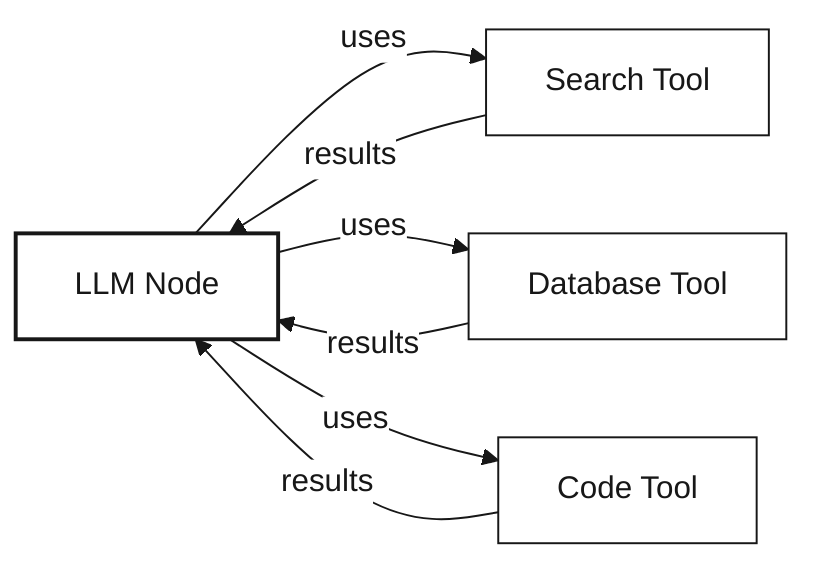

## Overview

AI nodes form the intelligence layer of Splox workflows, enabling LLM-powered reasoning and tool-based actions.

<CardGroup cols={2}>
  <Card title="LLM Node" icon="brain">
    Execute AI model completions with tool calling and memory
  </Card>
  <Card title="Tool Node" icon="wrench">
    Execute operations, call APIs, and integrate with external services
  </Card>
</CardGroup>

---

## LLM Node

**Purpose:** Execute AI model completions with tool calling, streaming, and memory

The LLM node is the core of agentic workflows, enabling AI models to generate responses, make decisions, and use tools.

  

  

**Node Handles:**

The LLM node has specialized input and output handles for different workflow paths:

<Tabs>
  <Tab title="Input Handle">
    **Left Side - Main Input**
    
    Receives data from previous nodes in the workflow. This is the primary execution trigger and data source for the LLM.
    
    **Accepts:**
    - Workflow context
    - User input/messages
    - Previous node outputs
    - Template variables
  </Tab>
  
  <Tab title="Output Handles">
    **Right Side Handles:**
    
    - **TOOLS:** Routes to tool nodes when LLM decides to call a function/tool
      - Activated when LLM generates tool call request
      - Passes tool call parameters to connected tool nodes
      - Used in agent patterns for tool-based actions
    
    - **PARALLEL:** Main output path for continuing workflow execution
      - Fires after LLM completes response generation
      - Passes LLM output to next workflow nodes
      - Enables branching to multiple downstream nodes
    
    - **ERROR:** Error handling path for failed executions
      - Activated on API errors, timeouts, or invalid responses
      - Passes error details for logging or recovery
      - Allows graceful error handling workflows
    
    **Bottom Handle:**
    
    - **MEMORY:** Connects to memory nodes for context management
      - Bidirectional: reads existing memory and writes new messages
      - Updates conversation history after each execution
      - Essential for maintaining chat context across iterations
  </Tab>
</Tabs>

**Key Features:**

<Tabs>
  <Tab title="Model Execution">
    - **Multi-Provider Support:** OpenAI, Anthropic, OpenRouter, custom providers
    - **Model Selection:** Choose from hundreds of models
    - **System Prompts:** Define AI behavior with template variables
    - **Streaming:** Real-time response generation
    - **Temperature Control:** Adjust creativity vs. consistency
  </Tab>
  
  <Tab title="Tool Calling">
    - **Automatic Tool Discovery:** Connected tool nodes (via TOOLS handle) are automatically available
    - **Multi-Tool Loops:** LLM can call multiple tools in sequence (in subflows)
    - **Structured Outputs:** Tools return typed data to the LLM
    - **Error Handling:** Failed tool calls are communicated back to the LLM
  </Tab>
  
  <Tab title="Memory Integration">
    - **Chat History:** Connect memory nodes (via MEMORY handle) to maintain conversation context
    - **Token Management:** Automatic trimming based on limits
    - **Summarization:** Condense old messages to save context window
    - **Custom Messages:** Pre-populate chat history programmatically
  </Tab>
</Tabs>

**Example Use Cases:**
- Customer support agents with CRM tools
- Research assistants with web search
- Code generation with execution sandboxes
- Content creation with multi-step refinement

---

## Tool Node

**Purpose:** Execute operations, call APIs, run code, and integrate with external services

Tool nodes enable LLMs to take actions in the real world.

  

  

**Node Handles:**

<Tabs>
  <Tab title="Input Handle">
    **Left Side - Tool Call Input**
    
    Receives tool call requests from LLM nodes or other workflow nodes.
    
    **Accepts:**
    - Tool call parameters from LLM
    - Direct invocation data
    - Workflow context variables
  </Tab>
  
  <Tab title="Output Handles">
    **Right Side Handles:**
    
    - **PARALLEL:** Main output path for successful tool execution
      - Fires after tool completes successfully
      - Passes tool results to next workflow nodes
      - Contains structured output data
    
    - **ERROR:** Error handling path for failed tool execution
      - Activated on execution errors, API failures, or timeouts
      - Passes error details and stack traces
      - Allows graceful error recovery
  </Tab>
</Tabs>

**Tool Types:**

<AccordionGroup>
  <Accordion title="Operations Tools" icon="plug">
    Execute platform-specific operations (API calls, database queries, etc.)
    
    **Features:**
    - OAuth integration support
    - Dynamic credential management
    - Input/output schema validation
    - Rate limiting and retry logic
    
    **Example:** Send email, create ticket, query database
  </Accordion>
  
  <Accordion title="Custom Tools" icon="code">
    Execute custom JavaScript/Python code with user-defined logic
    
    **Features:**
    - Full language support
    - Access to workflow context
    - Timeout protection
    - Error handling and logging
    
    **Example:** Data transformation, custom validation, calculations
  </Accordion>
  
  <Accordion title="MCP Tools" icon="server">
    Model Context Protocol servers for standardized tool interfaces
    
    **Features:**
    - Server-side tool execution
    - Stateful connections
    - Resource access patterns
    - Prompt injection protection
    
    **Example:** File system access, terminal execution, API wrappers
  </Accordion>
  
  <Accordion title="Workflow Tools" icon="diagram-project">
    Trigger other workflows as sub-tasks
    
    **Features:**
    - Specify target workflow and start node
    - Pass input data programmatically
    - Wait for completion or run async
    - Access sub-workflow outputs
    
    **Example:** Multi-agent systems, modular workflows, parallel processing
  </Accordion>
  
  <Accordion title="Sandbox Tools" icon="box">
    Execute code in isolated E2B sandboxes
    
    **Features:**
    - User-defined sandbox templates
    - Persistent sandbox instances
    - File system access
    - Package installation
    - Automatic inactivity pausing
    
    **Example:** Code execution, data science pipelines, test environments
  </Accordion>
</AccordionGroup>

### LLM Tool Integration

When connected to an LLM node, tools become automatically available to the AI model:

```mermaid
%%{init: {'theme':'base', 'themeVariables': {'primaryColor':'#252526','primaryTextColor':'#fafafa','primaryBorderColor':'#fafafa','lineColor':'#fafafa','secondaryColor':'#1e1e1e','tertiaryColor':'#252526','background':'#1e1e1e','mainBkg':'#252526','secondBkg':'#1e1e1e','textColor':'#fafafa','nodeTextColor':'#fafafa','nodeBorder':'#fafafa','edgeLabelBackground':'#252526'}}}%%
graph LR
    LLM[LLM Node] --> |uses| Tool1[Search Tool]
    LLM --> |uses| Tool2[Database Tool]
    LLM --> |uses| Tool3[Code Tool]
    
    Tool1 --> |results| LLM
    Tool2 --> |results| LLM
    Tool3 --> |results| LLM
    
    style LLM fill:#1e1e1e,stroke:#fafafa,stroke-width:2px
    style Tool1 fill:#1e1e1e,stroke:#fafafa
    style Tool2 fill:#1e1e1e,stroke:#fafafa
    style Tool3 fill:#1e1e1e,stroke:#fafafa
```

### Tool Calling Behavior

<Tabs>
  <Tab title="Outside Subflows">
    **Tool executes independently - no feedback loop**
    
    When an LLM node is in the main workflow (not in a subflow), tool execution is **one-directional**:
    
    1. LLM analyzes the request
    2. Decides which tool to use (if any)
    3. Calls the selected tool
    4. **Tool executes and completes**
    5. **Workflow continues to next node** (tool results don't return to LLM)
    
    The LLM doesn't receive tool results back - the tool simply executes as a separate step in the workflow.
    
    **Example:** LLM → Search Tool → (results go to next node) → Continue workflow
  </Tab>
  
  <Tab title="Inside Subflows">
    **Multiple tool calls through iteration**
    
    When an LLM node is inside a **subflow with a loop** (agent pattern), it can call tools **multiple times**:
    
    1. LLM analyzes the request
    2. Calls first tool (e.g., Search Tool)
    3. Results return → End Node → **Loop back to LLM**
    4. LLM analyzes search results
    5. Calls second tool (e.g., Database Tool)
    6. Results return → End Node → **Loop back to LLM**
    7. LLM has enough information
    8. Calls Stop Tool → Exits subflow
    
    **Example:** Multi-step agent that searches → queries database → creates ticket → completes
  </Tab>
</Tabs>

<Info>
  The ability to call tools multiple times is enabled by the **subflow loop**, not the LLM node itself. Outside subflows, tools execute independently without returning results to the LLM.
</Info>

The LLM decides which tools to use, when to use them, and can call tools multiple times before generating a final response.

---

## What's Next?

<CardGroup cols={2}>
  <Card title="Memory Nodes" icon="database" href="/concepts/nodes/memory-nodes">
    Learn how to maintain conversation context
  </Card>
  
  <Card title="Flow Control Nodes" icon="code-branch" href="/concepts/nodes/flow-control-nodes">
    Master Subflow nodes for agent patterns
  </Card>
  
  <Card title="Variable Mappings" icon="link" href="/concepts/nodes/variable-mappings">
    Reference data from previous nodes in prompts
  </Card>
  
  <Card title="Back to Overview" icon="cube" href="/concepts/nodes">
    Return to nodes overview
  </Card>
</CardGroup>
