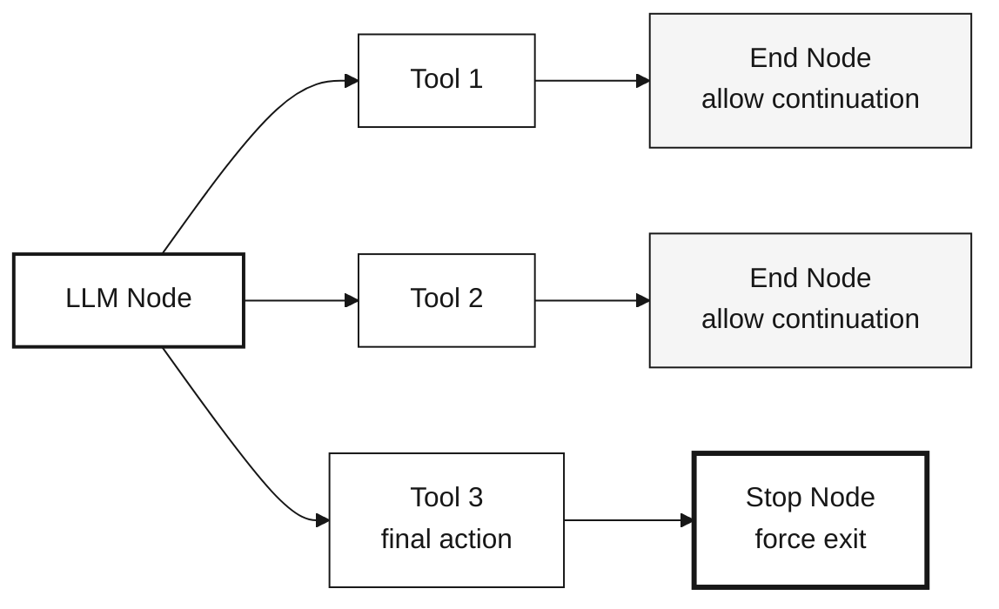

```mermaid
%%{init: {'theme':'base', 'themeVariables': {'primaryColor':'#252526','primaryTextColor':'#fafafa','primaryBorderColor':'#fafafa','lineColor':'#fafafa','secondaryColor':'#1e1e1e','tertiaryColor':'#252526','background':'#1e1e1e','mainBkg':'#252526','secondBkg':'#1e1e1e','textColor':'#fafafa','nodeTextColor':'#fafafa','nodeBorder':'#fafafa','edgeLabelBackground':'#252526'}}}%%
graph LR
    LLM[LLM Node] --> Tool1[Tool 1]
    LLM --> Tool2[Tool 2]
    LLM --> Tool3[Tool 3<br/>final action]
    
    Tool1 --> End1[End Node<br/>allow continuation]
    Tool2 --> End2[End Node<br/>allow continuation]
    Tool3 --> Stop[Stop Node<br/>force exit]
    
    style LLM fill:#1e1e1e,stroke:#fafafa,stroke-width:2px
    style Tool1 fill:#1e1e1e,stroke:#fafafa
    style Tool2 fill:#1e1e1e,stroke:#fafafa
    style Tool3 fill:#1e1e1e,stroke:#fafafa
    style End1 fill:#252526,stroke:#fafafa
    style End2 fill:#252526,stroke:#fafafa
    style Stop fill:#1e1e1e,stroke:#fafafa,stroke-width:3px
```

## Overview

Execution nodes control the fundamental flow of workflow execution—where workflows begin, where iterations end, and how subflows terminate.

<CardGroup cols={3}>
  <Card title="Start Node" icon="play">
    Entry point for workflow execution
  </Card>
  <Card title="End Node" icon="flag-checkered">
    Complete iterations or workflow
  </Card>
  <Card title="Stop Node" icon="stop">
    Force-terminate subflows immediately
  </Card>
</CardGroup>

---

## Start Node

**Purpose:** Entry point for workflow execution

Every workflow must have at least one start node. When a workflow is triggered, execution begins at the specified start node.

<div className="block dark:hidden">
  
</div>

<div className="hidden dark:block">
  
</div>

**Node Handles:**

<Tabs>
  <Tab title="Output Handles">
    **Right Side Handles:**
    
    - **PARALLEL:** Main output path after trigger activation
      - Fires when workflow starts
      - Passes trigger input data to next nodes
      - Enables workflow execution to begin
    
    - **ERROR:** Error handling path for trigger failures
      - Activated if trigger validation fails
      - Passes error details for logging
      - Allows error recovery at workflow start
  </Tab>
</Tabs>

**Features:**
- Multiple start nodes supported for multi-entry workflows
- Receives input data from workflow triggers
- Controls maximum trigger calls to prevent infinite loops
- Passes initial data to connected nodes via PARALLEL handle
- Error handling via ERROR handle for failed triggers

**Use Cases:**
- API endpoint entry points
- Scheduled task triggers
- Manual workflow execution
- Multi-agent workflow initialization

<Tip>
  Start nodes can be selected when triggering a workflow programmatically, allowing different entry points for different use cases.
</Tip>

---

## End Node

**Purpose:** Marks the end of a single iteration (in subflows) or workflow completion (in main workflows)

<div className="block dark:hidden">
  
</div>

<div className="hidden dark:block">
  
</div>

**Node Handles:**

<Tabs>
  <Tab title="Input Handle">
    **Left Side - Iteration/Workflow End**
    
    Receives data marking the end of execution flow.
    
    **Accepts:**
    - Final output data from workflow/iteration
    - Results to return to parent workflow (in subflows)
    - Data to pass to next iteration (in loops)
  </Tab>
  
  <Tab title="Output Handle">
    **Right Side - Loop Output (Subflows Only)**
    
    - **LOOP:** Connects back to Start node for iteration
      - Only active in subflow iteration patterns
      - Routes execution back to beginning of subflow
      - Continues loop if max_iterations not reached
    
    **Note:** In main workflows, End nodes have no output handles - they terminate execution.
  </Tab>
</Tabs>

**Features:**
- Multiple end nodes supported (different exit points)
- In **main workflows**: Marks workflow completion and returns output
- In **subflows**: Marks end of one iteration, loop may continue
- Output data passed to next iteration or parent workflow

<Info>
**End Node vs Stop Node in Subflows**

- **End Node**: Completes the current iteration. If more iterations remain, execution loops back to Start Node.
- **Stop Node**: Immediately terminates the entire subflow, regardless of remaining iterations.
</Info>

---

## Stop Node

**Purpose:** Force-terminate subflow execution immediately

Stop nodes set a `ForceFinish` flag that exits the subflow loop, regardless of `max_iterations`.

<div className="block dark:hidden">
  
</div>

<div className="hidden dark:block">
  
</div>

**Node Handles:**

<Tabs>
  <Tab title="Input Handle">
    **Left Side - Force Termination Trigger**
    
    Receives signal to immediately terminate subflow execution.
    
    **Accepts:**
    - Final output data before termination
    - Completion signal from tools (e.g., "send_final_response")
    - Error conditions requiring immediate exit
  </Tab>
</Tabs>

<Warning>
  Stop nodes have **no output handles**. They immediately terminate the subflow and return control to the parent workflow. Use End nodes if you need to continue workflow execution.
</Warning>

**Features:**
- **Immediate Termination:** Stops all remaining iterations in the subflow
- **Return to Parent:** Parent workflow continues from the node after the subflow
- **Iteration Override:** Bypasses max_iterations check
- **Last Output Returned:** Returns the output from the most recent completed iteration

**Use Cases:**
- Agent completes task and calls "send_final_response" tool → Stop
- Error condition requires immediate exit
- Task completion detected (no need for more iterations)
- Resource limits reached

**Behavior:**

<Tabs>
  <Tab title="In Subflows">
    **Stops the entire subflow iteration loop**
    
    <div className="block dark:hidden">
    ```mermaid
    %%{init: {'theme':'base', 'themeVariables': {'primaryColor':'#f5f5f5','primaryTextColor':'#171717','primaryBorderColor':'#171717','lineColor':'#171717','secondaryColor':'#ffffff','tertiaryColor':'#f5f5f5','background':'#ffffff','mainBkg':'#f5f5f5','secondBkg':'#ffffff','textColor':'#171717','nodeTextColor':'#171717','nodeBorder':'#171717','edgeLabelBackground':'#ffffff'}}}%%
    graph TD
        Start["Subflow Iteration"] --> LLM["LLM Executes"]
        LLM --> Tool["Tool Called"]
        Tool --> Decision{"Which Node<br/>Did Tool Lead To?"}
        
        Decision -->|"End Node"| Loop["Complete Iteration"]
        Decision -->|"Stop Node"| Exit["Force Exit"]
        
        Loop --> Check{"More Iterations<br/>Remaining?"}
        Check -->|"Yes"| Start
        Check -->|"No (max reached)"| Parent1["Return to<br/>Parent Workflow"]
        
        Exit ==> Parent2["Return to<br/>Parent Workflow<br/>(Immediately)"]
        
        style Start fill:#ffffff,stroke:#171717
        style LLM fill:#ffffff,stroke:#171717
        style Tool fill:#ffffff,stroke:#171717
        style Decision fill:#f5f5f5,stroke:#171717
        style Loop fill:#ffffff,stroke:#171717
        style Exit fill:#ffffff,stroke:#171717,stroke-width:3px
        style Check fill:#f5f5f5,stroke:#171717
        style Parent1 fill:#f5f5f5,stroke:#171717,stroke-width:2px
        style Parent2 fill:#f5f5f5,stroke:#171717,stroke-width:2px
    ```
    </div>
    
    <div className="hidden dark:block">
    ```mermaid
    %%{init: {'theme':'base', 'themeVariables': {'primaryColor':'#252526','primaryTextColor':'#fafafa','primaryBorderColor':'#fafafa','lineColor':'#fafafa','secondaryColor':'#1e1e1e','tertiaryColor':'#252526','background':'#1e1e1e','mainBkg':'#252526','secondBkg':'#1e1e1e','textColor':'#fafafa','nodeTextColor':'#fafafa','nodeBorder':'#fafafa','edgeLabelBackground':'#252526'}}}%%
    graph TD
        Start["Subflow Iteration"] --> LLM["LLM Executes"]
        LLM --> Tool["Tool Called"]
        Tool --> Decision{"Which Node<br/>Did Tool Lead To?"}
        
        Decision -->|"End Node"| Loop["Complete Iteration"]
        Decision -->|"Stop Node"| Exit["Force Exit"]
        
        Loop --> Check{"More Iterations<br/>Remaining?"}
        Check -->|"Yes"| Start
        Check -->|"No (max reached)"| Parent1["Return to<br/>Parent Workflow"]
        
        Exit ==> Parent2["Return to<br/>Parent Workflow<br/>(Immediately)"]
        
        style Start fill:#1e1e1e,stroke:#fafafa
        style LLM fill:#1e1e1e,stroke:#fafafa
        style Tool fill:#1e1e1e,stroke:#fafafa
        style Decision fill:#252526,stroke:#fafafa
        style Loop fill:#1e1e1e,stroke:#fafafa
        style Exit fill:#1e1e1e,stroke:#fafafa,stroke-width:3px
        style Check fill:#252526,stroke:#fafafa
        style Parent1 fill:#252526,stroke:#fafafa,stroke-width:2px
        style Parent2 fill:#252526,stroke:#fafafa,stroke-width:2px
    ```
    </div>
    
    **Even if max_iterations = 10, the Stop Node immediately terminates the subflow**
    
    Parent workflow resumes immediately from the node after the subflow
  </Tab>
  
  <Tab title="In Main Workflows">
    **Not typically used** - Use End Node instead
    
    Stop Nodes are designed for subflow control. In main workflows, they behave like End Nodes.
  </Tab>
</Tabs>

**Common Pattern:**

<div className="block dark:hidden">

</div>

<div className="hidden dark:block">

</div>

---

## What's Next?

<CardGroup cols={2}>
  <Card title="AI Nodes" icon="robot" href="/concepts/nodes/ai-nodes">
    Learn about LLM and Tool nodes for intelligent automation
  </Card>
  
  <Card title="Flow Control Nodes" icon="code-branch" href="/concepts/nodes/flow-control-nodes">
    Explore Subflow nodes for agent patterns
  </Card>
  
  <Card title="Variable Mappings" icon="link" href="/concepts/nodes/variable-mappings">
    Reference data from previous nodes
  </Card>
  
  <Card title="Back to Overview" icon="cube" href="/concepts/nodes">
    Return to nodes overview
  </Card>
</CardGroup>
