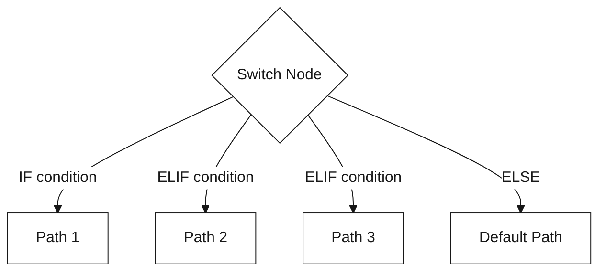
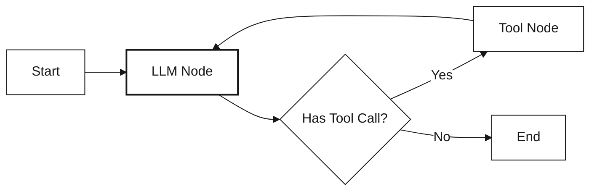
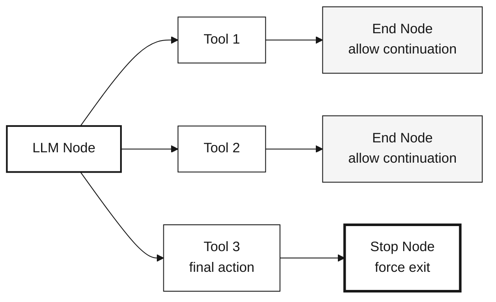

```mermaid
%%{init: {'theme':'base', 'themeVariables': {'primaryColor':'#252526','primaryTextColor':'#fafafa','primaryBorderColor':'#fafafa','lineColor':'#fafafa','secondaryColor':'#1e1e1e','tertiaryColor':'#252526','background':'#1e1e1e','mainBkg':'#252526','secondBkg':'#1e1e1e','textColor':'#fafafa','nodeTextColor':'#fafafa','nodeBorder':'#fafafa','edgeLabelBackground':'#252526'}}}%%
graph LR
    LLM[LLM Node] --> Tool1[Tool 1]
    LLM --> Tool2[Tool 2]
    LLM --> Tool3[Tool 3<br/>final action]
    
    Tool1 --> End1[End Node<br/>allow continuation]
    Tool2 --> End2[End Node<br/>allow continuation]
    Tool3 --> Stop[Stop Node<br/>force exit]
    
    style LLM fill:#1e1e1e,stroke:#fafafa,stroke-width:2px
    style Tool1 fill:#1e1e1e,stroke:#fafafa
    style Tool2 fill:#1e1e1e,stroke:#fafafa
    style Tool3 fill:#1e1e1e,stroke:#fafafa
    style End1 fill:#252526,stroke:#fafafa
    style End2 fill:#252526,stroke:#fafafa
    style Stop fill:#1e1e1e,stroke:#fafafa,stroke-width:3px
```

## Overview

Flow control nodes manage how workflows branch, merge, iterate, and nest.

<CardGroup cols={2}>
  <Card title="Switch Node" icon="code-branch">
    Conditional branching based on data evaluation
  </Card>
  <Card title="Merge Node" icon="code-merge">
    Combine multiple execution paths
  </Card>
  <Card title="Subflow Node" icon="diagram-nested">
    Create reusable nested workflows
  </Card>
</CardGroup>

---

### Switch Node

**Purpose:** Conditional branching based on data evaluation

Switch nodes evaluate conditions and route execution to different paths.

<div className="block dark:hidden">
  
</div>

<div className="hidden dark:block">
  
</div>

**Node Handles:**

<Tabs>
  <Tab title="Input Handle">
    **Left Side - Condition Input**
    
    Receives data to evaluate against conditional branches.
    
    **Accepts:**
    - Workflow variables
    - Previous node outputs
    - Template expressions
    - Any data for conditional evaluation
  </Tab>
  
  <Tab title="Output Handles">
    **Right Side Handles (Dynamic):**
    
    - **IF:** First condition branch (primary path)
      - Activated when IF conditions evaluate to true
      - Routes to nodes for first conditional path
    
    - **ELIF 1, ELIF 2, ...:** Additional condition branches
      - Evaluated in order if previous conditions are false
      - Multiple ELIF branches can be added dynamically
      - Each represents an else-if conditional path
    
    - **ELSE:** Fallback branch
      - Activated when all IF/ELIF conditions are false
      - Default path when no conditions match
      - Always evaluated last
    
    - **ERROR:** Error handling path
      - Activated on condition evaluation errors
      - Passes error details
      - Allows graceful error recovery
  </Tab>
</Tabs>

<Info>
  Switch nodes support dynamic branching: you can add multiple ELIF branches for complex conditional logic. Branches are evaluated in order: IF → ELIF 1 → ELIF 2 → ... → ELSE.
</Info>

**Condition Operators:**

Splox switch nodes support 14 different operators for flexible conditional logic:

<AccordionGroup>
  <Accordion title="String Matching (6 operators)" icon="text" defaultOpen>
    <ResponseField name="contains" type="string">
      Check if value contains substring (case-insensitive)
      
      **Example:** `"Hello World" contains "world"` → `true`
    </ResponseField>
    
    <ResponseField name="not_contains" type="string">
      Check if value does not contain substring
      
      **Example:** `"Hello World" not_contains "xyz"` → `true`
    </ResponseField>
    
    <ResponseField name="equals" type="string">
      Exact match comparison (case-insensitive)
      
      **Example:** `"admin" equals "ADMIN"` → `true`
    </ResponseField>
    
    <ResponseField name="not_equals" type="string">
      Not equal comparison
      
      **Example:** `"user" not_equals "admin"` → `true`
    </ResponseField>
    
    <ResponseField name="starts_with" type="string">
      Check if value starts with prefix
      
      **Example:** `"Hello World" starts_with "Hello"` → `true`
    </ResponseField>
    
    <ResponseField name="ends_with" type="string">
      Check if value ends with suffix
      
      **Example:** `"file.pdf" ends_with ".pdf"` → `true`
    </ResponseField>
  </Accordion>
  
  <Accordion title="List Operations (2 operators)" icon="list">
    <ResponseField name="in" type="string">
      Check if value exists in comma-separated list
      
      **Example:** `"apple" in "apple,banana,orange"` → `true`
    </ResponseField>
    
    <ResponseField name="not_in" type="string">
      Check if value does not exist in list
      
      **Example:** `"grape" not_in "apple,banana,orange"` → `true`
    </ResponseField>
  </Accordion>
  
  <Accordion title="Empty & Boolean Checks (4 operators)" icon="circle-check">
    <ResponseField name="is_empty" type="unary">
      Check if value is empty, null, `[]`, or `{}`
      
      **Example:** `"" is_empty` → `true`
    </ResponseField>
    
    <ResponseField name="is_not_empty" type="unary">
      Check if value has content
      
      **Example:** `"Hello" is_not_empty` → `true`
    </ResponseField>
    
    <ResponseField name="is_true" type="unary">
      Check if value is truthy (`true`, `1`, `yes`, `y`)
      
      **Example:** `"true" is_true` → `true`
    </ResponseField>
    
    <ResponseField name="is_false" type="unary">
      Check if value is falsy (`false`, `0`, `no`, `n`)
      
      **Example:** `"false" is_false` → `true`
    </ResponseField>
  </Accordion>
  
  <Accordion title="Numeric Comparison (4 operators)" icon="calculator">
    <ResponseField name="gt" type="number">
      Greater than (numeric comparison with string fallback)
      
      **Example:** `10 gt 5` → `true`
    </ResponseField>
    
    <ResponseField name="lt" type="number">
      Less than
      
      **Example:** `3 lt 7` → `true`
    </ResponseField>
    
    <ResponseField name="gte" type="number">
      Greater than or equal
      
      **Example:** `10 gte 10` → `true`
    </ResponseField>
    
    <ResponseField name="lte" type="number">
      Less than or equal
      
      **Example:** `5 lte 8` → `true`
    </ResponseField>
  </Accordion>
</AccordionGroup>

<Info>
  **Unary operators** (`is_empty`, `is_not_empty`, `is_true`, `is_false`) don't require a right operand.
</Info>

**Condition Logic:**

<Tabs>
  <Tab title="AND Logic">
    **All conditions must be true**
    
    ```typescript
    if (condition1 && condition2 && condition3) {
      // Take this path
    }
    ```
    
    Use for: Strict validation, multiple requirement checks
  </Tab>
  
  <Tab title="OR Logic">
    **Any condition can be true**
    
    ```typescript
    if (condition1 || condition2 || condition3) {
      // Take this path
    }
    ```
    
    Use for: Flexible matching, fallback scenarios
  </Tab>
</Tabs>

**Branching:**

Switch nodes support multiple branches evaluated in order:

<div className="block dark:hidden">

</div>

<div className="hidden dark:block">

</div>

```mermaid
%%{init: {'theme':'base', 'themeVariables': {'primaryColor':'#252526','primaryTextColor':'#fafafa','primaryBorderColor':'#fafafa','lineColor':'#fafafa','secondaryColor':'#1e1e1e','tertiaryColor':'#252526','background':'#1e1e1e','mainBkg':'#252526','secondBkg':'#1e1e1e','textColor':'#fafafa','nodeTextColor':'#fafafa','nodeBorder':'#fafafa','edgeLabelBackground':'#252526'}}}%%
graph TB
    Switch{Switch Node}
    Switch --> |IF condition| Path1[Path 1]
    Switch --> |ELIF condition| Path2[Path 2]
    Switch --> |ELIF condition| Path3[Path 3]
    Switch --> |ELSE| Default[Default Path]
    
    style Switch fill:#1e1e1e,stroke:#fafafa
    style Path1 fill:#1e1e1e,stroke:#fafafa
    style Path2 fill:#1e1e1e,stroke:#fafafa
    style Path3 fill:#1e1e1e,stroke:#fafafa
    style Default fill:#1e1e1e,stroke:#fafafa
```

- **IF:** First condition evaluated
- **ELIF:** Additional conditions (evaluated if previous failed)
- **ELSE:** Default path if no conditions match

**Example Use Cases:**
- Content moderation (check for inappropriate content)
- User role routing (admin vs. user paths)
- Error handling (check for error states)
- A/B testing (route based on user segment)

---

### Merge Node

**Purpose:** Combine data from multiple parallel paths

Merge nodes wait for all incoming connections to complete, then combine their outputs.

<div className="block dark:hidden">
  
</div>

<div className="hidden dark:block">
  
</div>

**Node Handles:**

<Tabs>
  <Tab title="Input Handle">
    **Left Side - Multiple Inputs**
    
    Accepts multiple incoming connections from parallel paths.
    
    **Functionality:**
    - Waits for all connected inputs to complete
    - Receives data from each parallel branch
    - Synchronizes parallel execution
    
    **Accepts:**
    - Multiple node outputs
    - Parallel branch results
    - Any data to merge
  </Tab>
  
  <Tab title="Output Handles">
    **Right Side Handles:**
    
    - **PARALLEL:** Main output with merged data
      - Fires after all inputs complete
      - Contains combined/merged output based on strategy
      - Continues workflow with unified data
    
    - **ERROR:** Error handling path
      - Activated if any input fails or merge operation errors
      - Passes error details
      - Allows graceful error recovery
  </Tab>
</Tabs>

<Info>
  Merge nodes act as synchronization points in workflows. They wait for ALL incoming connections to complete before executing the merge operation and continuing.
</Info>

**Merge Strategies:**

<Tabs>
  <Tab title="Object Merge">
    **Combine objects into single object**
    
    ```json
    // Input 1: {name: "John"}
    // Input 2: {age: 30}
    // Output: {name: "John", age: 30}
    ```
  </Tab>
  
  <Tab title="Array Merge">
    **Collect outputs into array**
    
    ```json
    // Input 1: "result1"
    // Input 2: "result2"
    // Output: ["result1", "result2"]
    ```
  </Tab>
  
  <Tab title="First Complete">
    **Use first completed input**
    
    Race condition - fastest path wins
  </Tab>
</Tabs>

**Use Cases:**
- Parallel API calls with combined results
- Multi-agent responses aggregation
- Redundant path execution (use fastest)
- Batch processing collection

---

### Subflow Node

**Purpose:** Execute reusable workflow components

Subflow nodes contain nested workflows that can be reused across multiple parent workflows.

<div className="block dark:hidden">
  
</div>

<div className="hidden dark:block">
  
</div>

**Node Structure:**

Subflows contain a nested canvas with their own Start and End nodes. The image above shows:
- **Left:** Start node (entry point to subflow)
- **Right:** End node (exit point from subflow)
- **Canvas:** Isolated workflow area for building reusable logic

<Tabs>
  <Tab title="External Handles">
    **Parent Workflow Connection**
    
    When viewed from the parent workflow, subflow nodes have standard handles:
    
    - **Input Handle (Left):** Receives data from parent workflow
      - Passes data to subflow's Start node
      - Triggers subflow execution
    
    - **Output Handles (Right):**
      - **PARALLEL:** Main output after subflow completes
        - Returns data from subflow's End node
        - Continues parent workflow
      - **ERROR:** Error handling path
        - Activated on subflow execution errors
        - Passes error details to parent
  </Tab>
  
  <Tab title="Internal Nodes">
    **Inside the Subflow Canvas**
    
    - **Start Node:** Entry point for subflow execution
      - Receives input from parent workflow
      - Has PARALLEL and ERROR output handles
    
    - **End Node:** Exit point for subflow
      - Returns data to parent workflow
      - In loops: marks end of iteration
      - Has input handle and optional loop output
    
    - **Other Nodes:** Any workflow nodes can be used inside
      - LLM, Tool, Switch, Merge, etc.
      - Isolated execution context
  </Tab>
</Tabs>

**Features:**
- **Encapsulation:** Isolated execution context
- **Reusability:** Use same subflow in multiple places
- **Iteration:** Can loop within subflow (agent patterns)
- **Parameters:** Pass data in/out via start/end nodes
- **Resizing:** Adjust canvas size to fit nested workflow

**Agent Subflow Pattern:**

<div className="block dark:hidden">

</div>

<div className="hidden dark:block">

</div>

```mermaid
%%{init: {'theme':'base', 'themeVariables': {'primaryColor':'#252526','primaryTextColor':'#fafafa','primaryBorderColor':'#fafafa','lineColor':'#fafafa','secondaryColor':'#1e1e1e','tertiaryColor':'#252526','background':'#1e1e1e','mainBkg':'#252526','secondBkg':'#1e1e1e','textColor':'#fafafa','nodeTextColor':'#fafafa','nodeBorder':'#fafafa','edgeLabelBackground':'#252526'}}}%%
graph LR
    Start[Start] --> LLM[LLM Node]
    LLM --> Check{Has Tool Call?}
    Check --> |Yes| Tool[Tool Node]
    Tool --> LLM
    Check --> |No| End[End]
    
    style Start fill:#1e1e1e,stroke:#fafafa
    style LLM fill:#1e1e1e,stroke:#fafafa,stroke-width:2px
    style Check fill:#1e1e1e,stroke:#fafafa
    style Tool fill:#1e1e1e,stroke:#fafafa
    style End fill:#1e1e1e,stroke:#fafafa
```

The subflow loops internally until the LLM completes its task, then returns results to the parent workflow.

---

### End Node

**Purpose:** Marks the end of a single iteration (in subflows) or workflow completion (in main workflows)

<div className="block dark:hidden">
  
</div>

<div className="hidden dark:block">
  
</div>

**Node Handles:**

<Tabs>
  <Tab title="Input Handle">
    **Left Side - Iteration/Workflow End**
    
    Receives data marking the end of execution flow.
    
    **Accepts:**
    - Final output data from workflow/iteration
    - Results to return to parent workflow (in subflows)
    - Data to pass to next iteration (in loops)
  </Tab>
  
  <Tab title="Output Handle">
    **Right Side - Loop Output (Subflows Only)**
    
    - **LOOP:** Connects back to Start node for iteration
      - Only active in subflow iteration patterns
      - Routes execution back to beginning of subflow
      - Continues loop if max_iterations not reached
    
    **Note:** In main workflows, End nodes have no output handles - they terminate execution.
  </Tab>
</Tabs>

**Features:**
- Multiple end nodes supported (different exit points)
- In **main workflows**: Marks workflow completion and returns output
- In **subflows**: Marks end of one iteration, loop may continue
- Output data passed to next iteration or parent workflow

<Info>
**End Node vs Stop Node in Subflows**

- **End Node**: Completes the current iteration. If more iterations remain, execution loops back to Start Node.
- **Stop Node**: Immediately terminates the entire subflow, regardless of remaining iterations.
</Info>

---

### Stop Node

**Purpose:** Force-terminate subflow execution immediately

Stop nodes set a `ForceFinish` flag that exits the subflow loop, regardless of `max_iterations`.

<div className="block dark:hidden">
  
</div>

<div className="hidden dark:block">
  
</div>

**Node Handles:**

<Tabs>
  <Tab title="Input Handle">
    **Left Side - Force Termination Trigger**
    
    Receives signal to immediately terminate subflow execution.
    
    **Accepts:**
    - Final output data before termination
    - Completion signal from tools (e.g., "send_final_response")
    - Error conditions requiring immediate exit
  </Tab>
</Tabs>

<Warning>
  Stop nodes have **no output handles**. They immediately terminate the subflow and return control to the parent workflow. Use End nodes if you need to continue workflow execution.
</Warning>

**Features:**
- **Immediate Termination:** Stops all remaining iterations in the subflow
- **Return to Parent:** Parent workflow continues from the node after the subflow
- **Iteration Override:** Bypasses max_iterations check
- **Last Output Returned:** Returns the output from the most recent completed iteration

**Use Cases:**
- Agent completes task and calls "send_final_response" tool → Stop
- Error condition requires immediate exit
- Task completion detected (no need for more iterations)
- Resource limits reached

**Behavior:**

<Tabs>
  <Tab title="In Subflows">
    **Stops the entire subflow iteration loop**
    
    <div className="block dark:hidden">
    ```mermaid
    %%{init: {'theme':'base', 'themeVariables': {'primaryColor':'#f5f5f5','primaryTextColor':'#171717','primaryBorderColor':'#171717','lineColor':'#171717','secondaryColor':'#ffffff','tertiaryColor':'#f5f5f5','background':'#ffffff','mainBkg':'#f5f5f5','secondBkg':'#ffffff','textColor':'#171717','nodeTextColor':'#171717','nodeBorder':'#171717','edgeLabelBackground':'#ffffff'}}}%%
    graph TD
        Start["Subflow Iteration"] --> LLM["LLM Executes"]
        LLM --> Tool["Tool Called"]
        Tool --> Decision{"Which Node<br/>Did Tool Lead To?"}
        
        Decision -->|"End Node"| Loop["Complete Iteration"]
        Decision -->|"Stop Node"| Exit["Force Exit"]
        
        Loop --> Check{"More Iterations<br/>Remaining?"}
        Check -->|"Yes"| Start
        Check -->|"No (max reached)"| Parent1["Return to<br/>Parent Workflow"]
        
        Exit ==> Parent2["Return to<br/>Parent Workflow<br/>(Immediately)"]
        
        style Start fill:#ffffff,stroke:#171717
        style LLM fill:#ffffff,stroke:#171717
        style Tool fill:#ffffff,stroke:#171717
        style Decision fill:#f5f5f5,stroke:#171717
        style Loop fill:#ffffff,stroke:#171717
        style Exit fill:#ffffff,stroke:#171717,stroke-width:3px
        style Check fill:#f5f5f5,stroke:#171717
        style Parent1 fill:#f5f5f5,stroke:#171717,stroke-width:2px
        style Parent2 fill:#f5f5f5,stroke:#171717,stroke-width:2px
    ```
    </div>
    
    <div className="hidden dark:block">
    ```mermaid
    %%{init: {'theme':'base', 'themeVariables': {'primaryColor':'#252526','primaryTextColor':'#fafafa','primaryBorderColor':'#fafafa','lineColor':'#fafafa','secondaryColor':'#1e1e1e','tertiaryColor':'#252526','background':'#1e1e1e','mainBkg':'#252526','secondBkg':'#1e1e1e','textColor':'#fafafa','nodeTextColor':'#fafafa','nodeBorder':'#fafafa','edgeLabelBackground':'#252526'}}}%%
    graph TD
        Start["Subflow Iteration"] --> LLM["LLM Executes"]
        LLM --> Tool["Tool Called"]
        Tool --> Decision{"Which Node<br/>Did Tool Lead To?"}
        
        Decision -->|"End Node"| Loop["Complete Iteration"]
        Decision -->|"Stop Node"| Exit["Force Exit"]
        
        Loop --> Check{"More Iterations<br/>Remaining?"}
        Check -->|"Yes"| Start
        Check -->|"No (max reached)"| Parent1["Return to<br/>Parent Workflow"]
        
        Exit ==> Parent2["Return to<br/>Parent Workflow<br/>(Immediately)"]
        
        style Start fill:#1e1e1e,stroke:#fafafa
        style LLM fill:#1e1e1e,stroke:#fafafa
        style Tool fill:#1e1e1e,stroke:#fafafa
        style Decision fill:#252526,stroke:#fafafa
        style Loop fill:#1e1e1e,stroke:#fafafa
        style Exit fill:#1e1e1e,stroke:#fafafa,stroke-width:3px
        style Check fill:#252526,stroke:#fafafa
        style Parent1 fill:#252526,stroke:#fafafa,stroke-width:2px
        style Parent2 fill:#252526,stroke:#fafafa,stroke-width:2px
    ```
    </div>
    
    **Even if max_iterations = 10, the Stop Node immediately terminates the subflow**
    
    Parent workflow resumes immediately from the node after the subflow
  </Tab>
  
  <Tab title="In Main Workflows">
    **Not typically used** - Use End Node instead
    
    Stop Nodes are designed for subflow control. In main workflows, they behave like End Nodes.
  </Tab>
</Tabs>

**Common Pattern:**

<div className="block dark:hidden">

</div>

<div className="hidden dark:block">

</div>

---


---

## What's Next?

<CardGroup cols={2}>
  <Card title="Execution Nodes" icon="play" href="/concepts/nodes/execution-nodes">
    Learn about Start, End, and Stop nodes
  </Card>
  
  <Card title="Data Nodes" icon="gear" href="/concepts/nodes/data-nodes">
    Explore Template and Transform nodes
  </Card>
  
  <Card title="Variable Mappings" icon="link" href="/concepts/nodes/variable-mappings">
    Reference data in conditions and templates
  </Card>
  
  <Card title="Back to Overview" icon="cube" href="/concepts/nodes">
    Return to nodes overview
  </Card>
</CardGroup>
