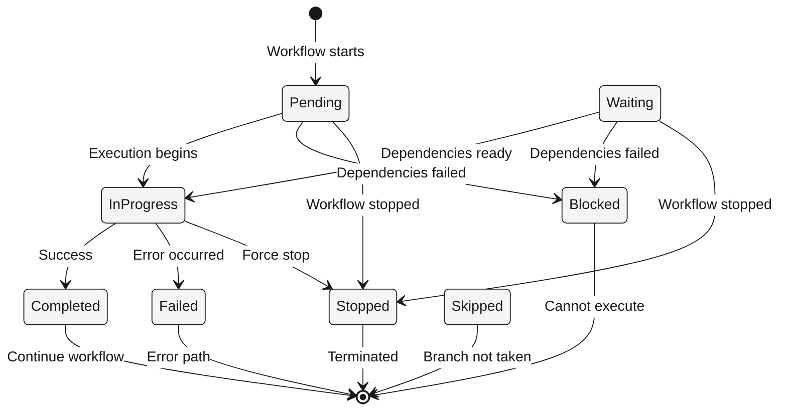
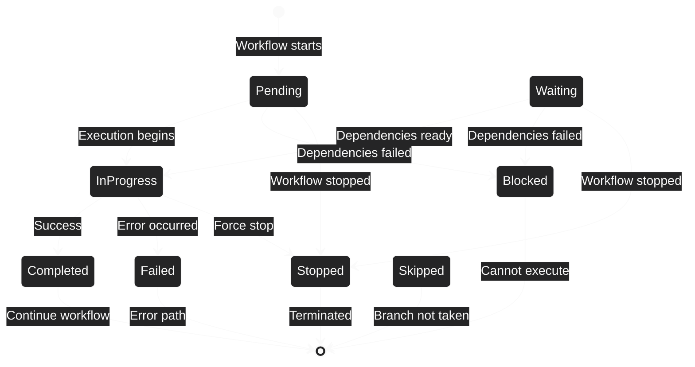

## Overview

Nodes go through various execution states as workflows run. Understanding these states helps you monitor and debug workflow execution.

---

## Execution States

<Steps>
  <Step title="Pending">
    Node is queued for execution but hasn't started yet
    
    **Visual:** Gray background
    
    **When it happens:**
    - Workflow just started
    - Waiting for previous nodes to complete
    - Queued in execution pipeline
  </Step>
  
  <Step title="In Progress">
    Node is currently executing
    
    **Visual:** Blue pulsing animation
    
    **When it happens:**
    - Node actively processing
    - LLM generating response
    - Tool executing action
    - Template rendering
  </Step>
  
  <Step title="Completed">
    Node executed successfully
    
    **Visual:** Green background with checkmark
    
    **When it happens:**
    - Execution finished without errors
    - Output data available
    - Ready to trigger next nodes
  </Step>
  
  <Step title="Failed">
    Node execution encountered an error
    
    **Visual:** Red background with error icon
    
    **When it happens:**
    - API errors or timeouts
    - Invalid configuration
    - Tool execution failures
    - Template syntax errors
  </Step>
  
  <Step title="Waiting">
    Node is waiting for dependencies (parallel execution)
    
    **Visual:** Yellow background
    
    **When it happens:**
    - Waiting for parallel branches to complete
    - Merge node waiting for all inputs
    - Dependencies not yet satisfied
  </Step>
  
  <Step title="Blocked">
    Node cannot execute due to missing dependencies
    
    **Visual:** Orange background
    
    **When it happens:**
    - Required input node didn't execute
    - Conditional branch not taken
    - Invalid workflow configuration
  </Step>
  
  <Step title="Skipped">
    Node was skipped (conditional branching)
    
    **Visual:** Gray background with skip icon
    
    **When it happens:**
    - Switch node condition not met
    - Unselected conditional branch
    - Workflow path not taken
  </Step>
  
  <Step title="Stopped">
    Workflow was stopped before reaching this node
    
    **Visual:** Dark gray background
    
    **When it happens:**
    - Manual workflow stop
    - Stop node triggered in subflow
    - Error in previous critical node
  </Step>
</Steps>

---

## State Transitions

---

## Debugging Tips

<CardGroup cols={2}>
  <Card title="Check Failed Nodes" icon="bug">
    Look for red nodes to identify where execution failed
    
    View error messages in node outputs
  </Card>
  
  <Card title="Review Blocked Nodes" icon="ban">
    Orange nodes indicate dependency issues
    
    Check if required previous nodes executed
  </Card>
  
  <Card title="Trace Skipped Paths" icon="route">
    Gray skipped nodes show unused branches
    
    Verify Switch node conditions are correct
  </Card>
  
  <Card title="Monitor In Progress" icon="spinner">
    Blue pulsing nodes show active execution
    
    Long execution times may indicate timeouts
  </Card>
</CardGroup>

---

## What's Next?

<CardGroup cols={2}>
  <Card title="Testing Workflows" icon="flask" href="/guides/testing-workflows">
    Learn how to test and debug workflows
  </Card>
  
  <Card title="Error Handling" icon="triangle-exclamation" href="/concepts/edges">
    Use ERROR handles for graceful error recovery
  </Card>
  
  <Card title="Execution Nodes" icon="play" href="/concepts/nodes/execution-nodes">
    Control workflow flow with Start, End, Stop
  </Card>
  
  <Card title="Back to Overview" icon="cube" href="/concepts/nodes">
    Return to nodes overview
  </Card>
</CardGroup>
