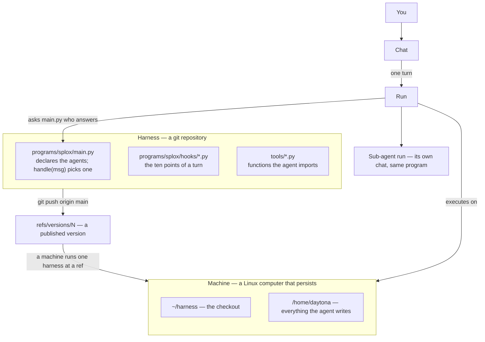

Six words carry the rest of this documentation. This page puts them in one
picture and then walks a single message through all of them.

| Word | What it is |
| --- | --- |
| [Machine](/concepts/machine) | The Linux computer an agent runs on. Its disk persists. |
| [Harness](/concepts/harness) | The agent's own git repository: the code that decides who it is. |
| [Program](/concepts/program) | A directory under `programs/` with a `main.py` that declares agents. |
| [Agent](/concepts/agent) | One `agent(...)` call inside a program: prompt, model, tools. |
| [Run](/concepts/run) | One execution of an agent, with its messages, outputs and usage. |
| Chat | A conversation in the app. One turn of it is a run. |



## One message, end to end

<Steps>

<Step title="The message arrives at the harness, not at an agent">

A chat is attached to a machine, and a machine runs exactly one harness at one
ref. So the message has an address — this harness, this commit — before anybody
has decided who answers it.

</Step>

<Step title="handle(msg) says who takes it">

`programs/splox` is the program a chat is answered by; the name is fixed, because
a person opens a harness rather than a program. Its `handle(msg)` is asked:

```python
def handle(msg):
    return assistant
```

`msg` carries `text`, `chat_id` and `user_id`. Answer with an agent this program
declared. The agent named is written down as the run's agent, so a run asked
twice — a retry, a wake-up, somebody reading the trace next week — names the same
agent every time.

</Step>

<Step title="The same file is asked who that agent is">

The prompt, the model, the provider, the tools and the iteration cap are not
settings the platform stores. They are a question it asks `main.py` at the moment
it needs the answer, and the answer is whatever the file says right then:

```python
assistant = agent(
    "Assistant",
    system_prompt="You have a Linux machine. Do the work, then say what you did.",
    model="kimi-k3",
    provider="splox",
    tools=["system:compute"],
    max_iterations=1000,
)
```

A chat message is a run, so a line edited between two messages is read by the
second one — with nothing published in between.

</Step>

<Step title="The turn runs, with that program's hooks around it">

`hooks/context.py` builds what the model is given. `hooks/model.py` may name a
different model for this turn. `hooks/tools.py` sees every call before and after
it runs. `hooks/guard.py` decides whether the turn may go on. `hooks/errors.py`
answers a provider that failed. Hooks belong to their program: an agent of
another program runs on that program's files. See [Hooks](/build/hooks).

</Step>

<Step title="Tool calls execute on the machine">

A tool is a Python function, and it runs inside the machine's sandbox — with its
filesystem, its network and its installed packages. Editing a tool file in the
checkout changes the tool on the next call, with no publish and no restart.

</Step>

<Step title="What is left behind is a run">

Messages, outputs, events, usage, and a tree if the agent handed work to a
sub-agent. A spawn is an ordinary run in a chat of its own, parented to the
caller's, belonging to the same program and running on the same hooks. See
[Runs](/concepts/run).

</Step>

</Steps>

## The three things worth internalizing

**One machine, and it persists.** Files written in one chat are found by the next
one. Programs started in one turn keep running after it ends. The machine is the
unit of continuity, not the conversation.

**Asked, not stored.** Almost nothing about an agent is configuration the
platform holds. The run keeps an address — the program and the agent's name — and
every other answer is asked of the tree in the sandbox at the moment it is
needed.

**Published, not deployed.** `git push origin main` from the checkout makes a new
version. The next chat opens on it; a run already going keeps the version it
started with, so nothing you push interrupts anything that is running.

<CardGroup cols={3}>
  <Card title="Machine" icon="server" href="/concepts/machine" />
  <Card title="Harness" icon="code-branch" href="/concepts/harness" />
  <Card title="Program" icon="folder" href="/concepts/program" />
  <Card title="Agent" icon="robot" href="/concepts/agent" />
  <Card title="Run" icon="play" href="/concepts/run" />
  <Card title="Model" icon="brain" href="/concepts/model" />
</CardGroup>
