## What is a Workflow?

A **workflow** in Splox is a visual, node-based automation that connects AI models, tools, and integrations to accomplish complex tasks. Think of it as a programmable flowchart where each box (node) performs a specific action, and arrows (edges) define the execution path and data flow.

Workflows are the foundation of Splox, enabling you to:

<CardGroup cols={2}>
  <Card title="AI Model Orchestration" icon="brain">
    Chain multiple LLMs together with sequential or parallel execution patterns
  </Card>
  <Card title="Tool Integration" icon="wrench">
    Connect AI agents to external tools, APIs, databases, and third-party platforms
  </Card>
  <Card title="Agentic Behavior" icon="robot">
    Build intelligent agents that make decisions, use tools iteratively, and accomplish complex goals
  </Card>
  <Card title="Multi-Agent Systems" icon="users">
    Create collaborative AI systems where multiple agents communicate asynchronously in parallel
  </Card>
  <Card title="Data Processing" icon="filter">
    Transform and process data through multi-step pipelines with branching logic
  </Card>
  <Card title="Reusable Components" icon="cubes">
    Design modular subflows that can be nested and reused across multiple workflows
  </Card>
</CardGroup>

### Key Capabilities

- **Visual Programming** - Build complex logic without code using an intuitive canvas interface
- **Chat Mode** - Test interactively with conversational interface and real-time feedback
- **Flexible Patterns** - Support for sequential, parallel, conditional, and looping execution
- **Real-time Testing** - See nodes execute live with immediate feedback
- **Version Control** - Track changes, publish versions, and roll back when needed

## Workflow Structure

### Components

Every workflow consists of two main components:

<CardGroup cols={2}>
  <Card title="Nodes" icon="circle-nodes">
    Individual units of work - AI models, tools, transformations, or control flow logic
  </Card>
  <Card title="Edges" icon="arrow-right-arrow-left">
    Connections between nodes that define execution order and data flow
  </Card>
</CardGroup>

### Visual Canvas

Workflows are built on a visual canvas with powerful editing capabilities:

<CardGroup cols={2}>
  <Card title="Add Nodes" icon="circle-plus">
    Right-click anywhere on the canvas to open a context menu with available nodes
  </Card>
  <Card title="Connect Nodes" icon="link">
    Draw edges between nodes by dragging from output to input ports
  </Card>
  <Card title="Configure" icon="gear">
    Click any node to open its settings panel and configure parameters
  </Card>
  <Card title="Navigate" icon="hand">
    Pan by dragging the canvas, zoom with mouse wheel or trackpad
  </Card>
  <Card title="Organize" icon="layer-group">
    Group related nodes into subflows for better organization
  </Card>
  <Card title="Undo/Redo" icon="rotate-left">
    Full history support - easily revert changes or restore edits
  </Card>
</CardGroup>

<Frame>
  

    
  

  
  

    
  

</Frame>

## Workflow Lifecycle

<Steps>
  <Step title="Creation">
    When you create a new workflow, Splox automatically:
    - Generates a unique workflow ID
    - Sets up an empty canvas
    - Assigns it to your account
    - Creates initial configuration
  </Step>

  <Step title="Building">
    Build your workflow by:
    - Adding nodes from the context menu
    - Connecting nodes with edges
    - Configuring each node's settings
    - Testing individual nodes
    - Saving your changes

    <Tip>
      **Test as you build** - Use the "Run Node" feature to verify each component works before connecting everything together.
    </Tip>
  </Step>

  <Step title="Testing & Execution">
    ### Chat Mode

    **Purpose:** Interactive, conversational interface for testing and debugging workflows.

    **Features:**
    - In-editor panel (680px sliding panel)
    - Chat-based conversational interaction
    - Real-time execution with node highlighting
    - Multiple chat sessions management
    - Persistent chat history
    - Start node selection

    **Chat Actions:**
    - Create new chat
    - Switch between existing chats
    - Clear chat memory (flush history)
    - Delete chat
    - Share chat publicly
    - Leave chat session

    **Best for:**
    - Development and testing
    - Debugging workflow logic
    - Iterating on conversation flows
    - Collaborative testing

    <Frame>
      

        
      

      
      

        
      

    </Frame>

    ### Execution Flow

    <Steps>
      <Step title="Select Start Node">
        Choose where to begin execution from the available start nodes
      </Step>
      <Step title="Provide Inputs">
        Enter required parameters, messages, or upload files
      </Step>
      <Step title="Run Workflow">
        Execute using either Chat Mode or I/O Mode
      </Step>
      <Step title="Monitor Execution">
        Watch real-time status updates as nodes process
      </Step>
      <Step title="View Results">
        See outputs from end nodes and review execution logs
      </Step>
    </Steps>

    ### Testing Checklist

    <AccordionGroup>
      <Accordion title="Node Output Verification" icon="check-circle">
        - Verify each node produces expected output format
        - Check data types match downstream requirements
        - Validate transformations are correct
      </Accordion>
      <Accordion title="Data Flow Validation" icon="arrow-right">
        - Confirm data passes correctly between nodes
        - Test edge connections work as expected
        - Verify parallel branches merge properly
      </Accordion>
      <Accordion title="Error Handling" icon="triangle-exclamation">
        - Test failure scenarios for critical nodes
        - Verify error edges activate correctly
        - Check fallback logic works as intended
      </Accordion>
      <Accordion title="Edge Cases" icon="flask">
        - Test with empty inputs
        - Try unexpected data formats
        - Verify timeout handling
        - Test rate limit scenarios
      </Accordion>
    </AccordionGroup>

    <Warning>
      Test your workflows thoroughly before setting up triggers. Failed workflows can still consume credits and API calls.
    </Warning>
  </Step>

  <Step title="Deployment">
    Once tested, deploy your workflow by:
    - Setting up triggers (webhooks, schedules, forms)
    - Configuring execution settings
    - Enabling the workflow
    - Monitoring the first few runs
  </Step>

  <Step title="Monitoring">
    After deployment, monitor your workflow:
    - View execution history
    - Check success/failure rates
    - Review error logs
    - Analyze performance metrics
    - Optimize as needed
  </Step>
</Steps>

## Execution Model

### Sequential Flow

By default, workflows execute sequentially:

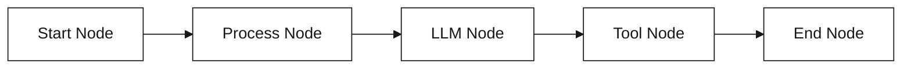

```mermaid
%%{init: {'theme':'base', 'themeVariables': {'primaryColor':'#252526','primaryTextColor':'#fafafa','primaryBorderColor':'#fafafa','lineColor':'#fafafa','secondaryColor':'#1e1e1e','tertiaryColor':'#252526','background':'#1e1e1e','mainBkg':'#252526','secondBkg':'#1e1e1e','textColor':'#fafafa','nodeTextColor':'#fafafa','nodeBorder':'#fafafa','edgeLabelBackground':'#252526'}}}%%
graph LR
    Start[Start Node] --> Process[Process Node] --> LLM[LLM Node] --> Tool[Tool Node] --> End[End Node]
    
    style Start fill:#1e1e1e,stroke:#fafafa
    style Process fill:#1e1e1e,stroke:#fafafa
    style LLM fill:#1e1e1e,stroke:#fafafa
    style Tool fill:#1e1e1e,stroke:#fafafa
    style End fill:#1e1e1e,stroke:#fafafa
```

Each node completes before the next one begins.

### Parallel Execution

Use the **Merge** node to execute multiple branches in parallel:

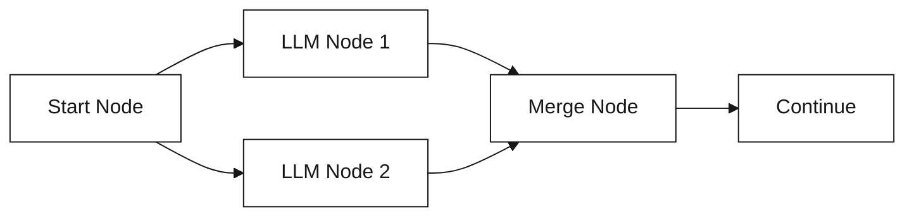

```mermaid
%%{init: {'theme':'base', 'themeVariables': {'primaryColor':'#252526','primaryTextColor':'#fafafa','primaryBorderColor':'#fafafa','lineColor':'#fafafa','secondaryColor':'#1e1e1e','tertiaryColor':'#252526','background':'#1e1e1e','mainBkg':'#252526','secondBkg':'#1e1e1e','textColor':'#fafafa','nodeTextColor':'#fafafa','nodeBorder':'#fafafa','edgeLabelBackground':'#252526'}}}%%
graph LR
    Start[Start Node] --> LLM1[LLM Node 1]
    Start --> LLM2[LLM Node 2]
    LLM1 --> Merge[Merge Node]
    LLM2 --> Merge
    Merge --> Continue[Continue]
    
    style Start fill:#1e1e1e,stroke:#fafafa
    style LLM1 fill:#1e1e1e,stroke:#fafafa
    style LLM2 fill:#1e1e1e,stroke:#fafafa
    style Merge fill:#1e1e1e,stroke:#fafafa
    style Continue fill:#1e1e1e,stroke:#fafafa
```

Both LLM nodes run simultaneously, and the merge node waits for both to complete.

### Conditional Branching

Use the **Switch** node for conditional logic:

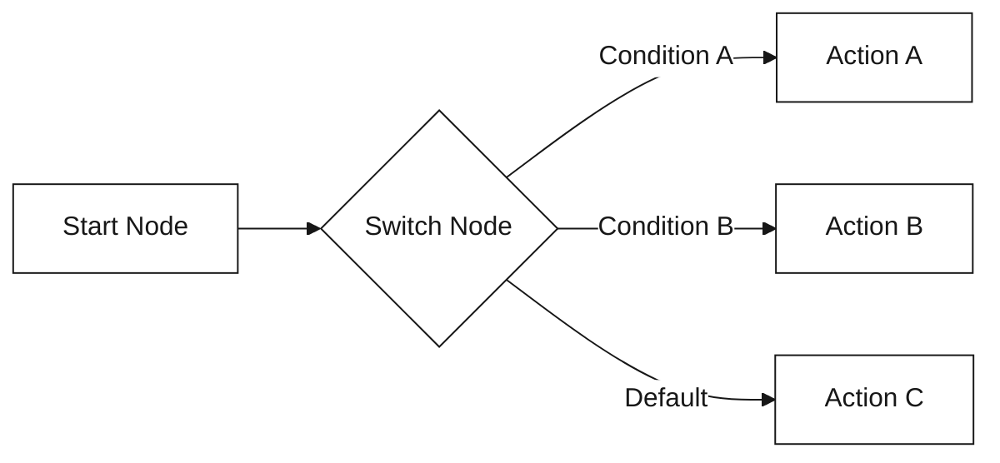

```mermaid
%%{init: {'theme':'base', 'themeVariables': {'primaryColor':'#252526','primaryTextColor':'#fafafa','primaryBorderColor':'#fafafa','lineColor':'#fafafa','secondaryColor':'#1e1e1e','tertiaryColor':'#252526','background':'#1e1e1e','mainBkg':'#252526','secondBkg':'#1e1e1e','textColor':'#fafafa','nodeTextColor':'#fafafa','nodeBorder':'#fafafa','edgeLabelBackground':'#252526'}}}%%
graph LR
    Start[Start Node] --> Switch{Switch Node}
    Switch -->|Condition A| ActionA[Action A]
    Switch -->|Condition B| ActionB[Action B]
    Switch -->|Default| ActionC[Action C]
    
    style Start fill:#1e1e1e,stroke:#fafafa
    style Switch fill:#1e1e1e,stroke:#fafafa
    style ActionA fill:#1e1e1e,stroke:#fafafa
    style ActionB fill:#1e1e1e,stroke:#fafafa
    style ActionC fill:#1e1e1e,stroke:#fafafa
```

The workflow takes different paths based on conditions you define.

### Agent Workflows with Subflows

AI agents use **subflows** to create intelligent, iterative behavior where the LLM can use tools multiple times until it decides to stop:

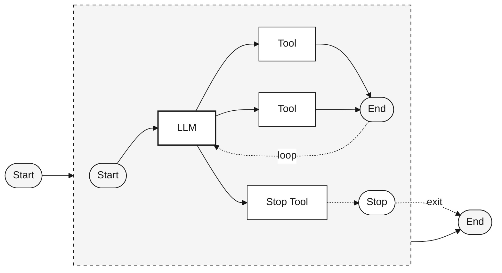

```mermaid
%%{init: {'theme':'base', 'themeVariables': {'primaryColor':'#252526','primaryTextColor':'#fafafa','primaryBorderColor':'#fafafa','lineColor':'#fafafa','secondaryColor':'#1e1e1e','tertiaryColor':'#252526','background':'#1e1e1e','mainBkg':'#252526','secondBkg':'#1e1e1e','textColor':'#fafafa','nodeTextColor':'#fafafa','nodeBorder':'#fafafa','edgeLabelBackground':'#252526'}}}%%
graph LR
    Start([Start]) --> Subflow
    
    subgraph Subflow[" "]
        direction TB
        S([Start]) --> LLM[LLM]
        LLM --> T1[Tool]
        LLM --> T2[Tool]
        LLM --> T3[Stop Tool]
        T1 --> E([End])
        T2 --> E
        T3 -.-> Stop([Stop])
        E -.loop.-> LLM
    end
    
    Subflow --> End([End])
    Stop -.exit.-> End
    
    style Subflow fill:#252526,stroke:#fafafa,stroke-width:1px,stroke-dasharray: 5 5
    style LLM fill:#1e1e1e,stroke:#fafafa,stroke-width:2px
    style T1 fill:#1e1e1e,stroke:#fafafa
    style T2 fill:#1e1e1e,stroke:#fafafa
    style T3 fill:#1e1e1e,stroke:#fafafa
    style Stop fill:#1e1e1e,stroke:#fafafa
```

**How the Agent Loop Works:**

<Steps>
  <Step title="LLM Analyzes Task">
    The LLM evaluates the current context and decides what action to take next
  </Step>
  
  <Step title="Tool Selection">
    Based on the analysis, the LLM can:
    - **Use a regular tool** (Search, Check Status, Create Ticket) → Results return to LLM
    - **Use the Stop tool** → Exits the subflow immediately
  </Step>
  
  <Step title="Iteration or Exit">
    - **Regular tools** → Flow hits End Node → Loops back to LLM with tool results
    - **Stop tool** → Flow hits Stop Node → Exits subflow entirely, no more iterations
  </Step>
  
  <Step title="Final Output">
    When the Stop tool is called, the subflow terminates and returns final output to the main workflow
  </Step>
</Steps>

**Key Components:**

<Tabs>
  <Tab title="End Node">
    **Purpose:** Complete one iteration and allow the loop to continue
    
    - Regular tools connect to the End Node
    - End Node signals "iteration complete, ready for next"
    - If under **Number of Iterations** limit, workflow loops back to LLM
    - LLM receives tool results and decides next action
    
    **Use when:** Tool provides data the LLM needs to continue reasoning
  </Tab>
  
  <Tab title="Stop Node">
    **Purpose:** Force-exit the entire subflow immediately
    
    - Stop tool connects to the Stop Node
    - Stop Node terminates all iterations instantly
    - No more loops, no matter the iteration count
    - Final response is returned to parent workflow
    
    **Use when:** LLM has completed the task and no further iteration needed
  </Tab>
  
  <Tab title="Iteration Control">
    **Subflow Node Configuration:**
    
    - **Iterate Over:** Number of Times (Count)
    - **Number of Iterations:** 10 (configurable limit)
    - **Execution Mode:** Sequential
    
    **Loop Behavior:**
    - Loop continues until Number of Iterations limit reached
    - **OR** until Stop Node is reached (force exit)
    - Stop Node overrides iteration limits (immediate termination)
    - End Node respects iteration limits (loops if under limit)
  </Tab>
</Tabs>

**Example: Customer Support Agent**

<Accordion title="Complete Agent Flow Explained" icon="robot">
  **Scenario:** User asks "What's the status of my order #12345?"
  
  **Execution Steps:**
  
  1. **Iteration 1:**
     - LLM receives question
     - Decides to use "Check Order Status" tool
     - Tool executes → Returns "Order shipped, tracking: XYZ123"
     - Hits End Node → Loops back to LLM
  
  2. **Iteration 2:**
     - LLM receives order status result
     - Has enough information to answer
     - Calls "Stop Subflow" tool with response: "Your order has shipped! Tracking number: XYZ123"
     - Hits Stop Node → Exits subflow
  
  3. **Final Output:**
     - Subflow returns LLM's final response
     - Main workflow continues with the result
  
  **Available Tools:**
  - `search_knowledge_base` → For finding help articles
  - `check_order_status` → For order lookups
  - `create_support_ticket` → For escalations
  - `stop_subflow` → **Required!** To exit when done
  
  **Why Stop Node is Critical:**
  Without the Stop tool, the agent would hit the Number of Iterations limit every time, even when the task is complete early. The Stop Node enables efficient early exits.
</Accordion>

<Info>
  **Best Practice:** Always provide a "stop" or "complete task" tool in agent subflows. This allows the LLM to exit efficiently when the job is done, rather than waiting for iteration limit.
</Info>

<Warning>
  If you don't provide a Stop tool/node, the subflow will always run until Number of Iterations limit is reached, wasting resources and time.
</Warning>

### Multi-Agent Workflows

Multi-agent systems enable multiple AI agents to collaborate by communicating asynchronously and in parallel:

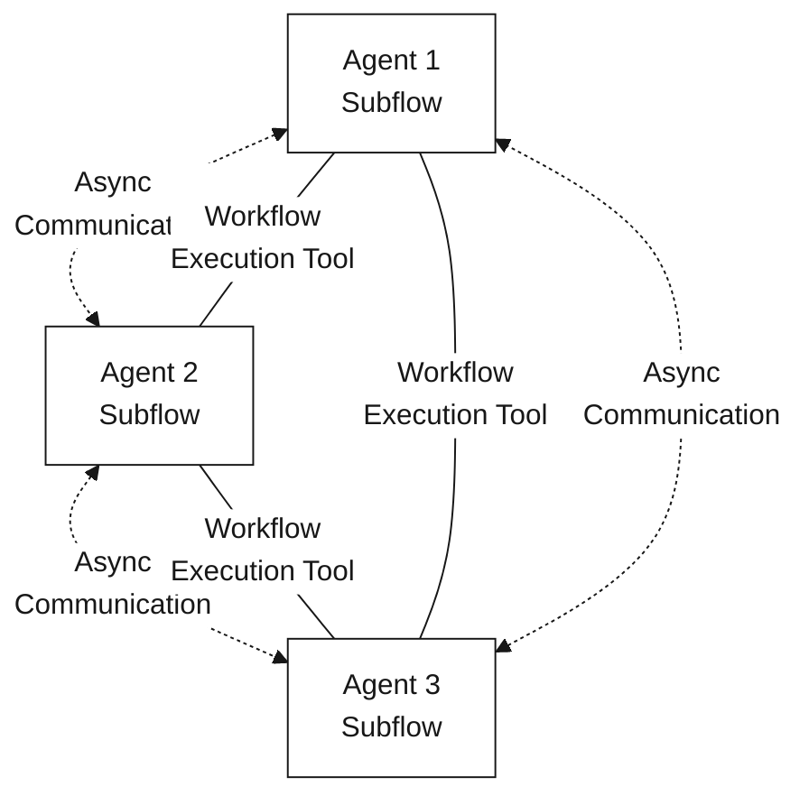

```mermaid
%%{init: {'theme':'base', 'themeVariables': {'primaryColor':'#252526','primaryTextColor':'#fafafa','primaryBorderColor':'#fafafa','lineColor':'#fafafa','secondaryColor':'#1e1e1e','tertiaryColor':'#252526','background':'#1e1e1e','mainBkg':'#252526','secondBkg':'#1e1e1e','textColor':'#fafafa','nodeTextColor':'#fafafa','nodeBorder':'#fafafa','edgeLabelBackground':'#252526'}}}%%
graph TB
    Agent1[Agent 1<br/>Subflow] <-.->|Async<br/>Communication| Agent2[Agent 2<br/>Subflow]
    Agent2 <-.->|Async<br/>Communication| Agent3[Agent 3<br/>Subflow]
    Agent3 <-.->|Async<br/>Communication| Agent1
    
    Agent1 ---|Workflow<br/>Execution Tool| Agent2
    Agent2 ---|Workflow<br/>Execution Tool| Agent3
    Agent1 ---|Workflow<br/>Execution Tool| Agent3
    
    style Agent1 fill:#1e1e1e,stroke:#fafafa
    style Agent2 fill:#1e1e1e,stroke:#fafafa
    style Agent3 fill:#1e1e1e,stroke:#fafafa
```

**How it works:**
1. Multiple agents execute in parallel, each in their own subflow
2. Agents communicate asynchronously using the **Workflow Execution tool**
3. Each agent can trigger other agents by specifying workflow and start node
4. Agents work concurrently without blocking each other
5. Communication flows freely in any direction between agents

**Collaboration Patterns:**
- **Actor Model:** Agents communicate peer-to-peer, passing messages directly
- **Orchestrator Model:** One agent coordinates tasks and aggregates results
- **Hybrid Patterns:** Mix of orchestration and peer-to-peer communication
- **Custom Topologies:** Design any collaboration pattern that fits your use case

**Key Features:**
- **Parallel Execution:** Multiple agents work simultaneously
- **Asynchronous Communication:** Agents use Workflow Execution tool to trigger other agents
- **Start Node Selection:** Each agent specifies entry points in target workflows
- **Flexible Architecture:** Support for any collaboration pattern (actor, orchestrator, hybrid)
- **Specialization:** Different agents can have different capabilities and responsibilities

**Example Use Cases:**
- **Research Pipeline:** Agents collaborate to search, analyze, and summarize information
- **Content Creation:** Multiple agents handle research, outlining, writing, and editing
- **Data Processing:** Agents work together on ingestion, validation, transformation, and storage
- **Collaborative Problem Solving:** Agents debate, critique, and refine solutions together

<Tip>
  Multi-agent workflows excel at complex tasks that benefit from specialized expertise, parallel processing, and collaborative reasoning.
</Tip>

### Error Handling

Every node can have an **error edge** that activates when the node fails:

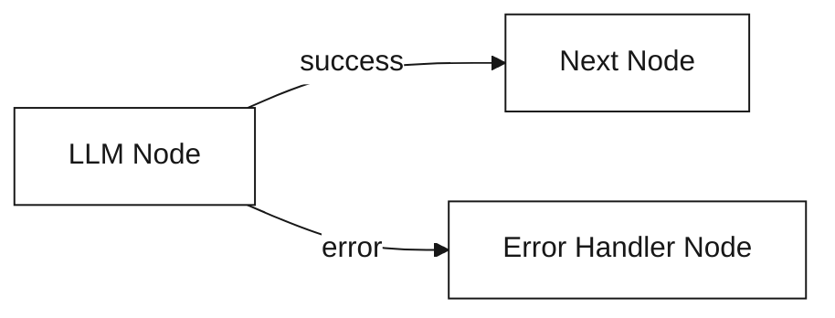

```mermaid
%%{init: {'theme':'base', 'themeVariables': {'primaryColor':'#252526','primaryTextColor':'#fafafa','primaryBorderColor':'#fafafa','lineColor':'#fafafa','secondaryColor':'#1e1e1e','tertiaryColor':'#252526','background':'#1e1e1e','mainBkg':'#252526','secondBkg':'#1e1e1e','textColor':'#fafafa','nodeTextColor':'#fafafa','nodeBorder':'#fafafa','edgeLabelBackground':'#252526'}}}%%
graph LR
    LLM[LLM Node] -->|success| Next[Next Node]
    LLM -->|error| Error[Error Handler Node]
    
    style LLM fill:#1e1e1e,stroke:#fafafa
    style Next fill:#1e1e1e,stroke:#fafafa
    style Error fill:#1e1e1e,stroke:#fafafa
```

<Info>
  Error edges are indicated by red connections in the workflow editor.
</Info>

## Best Practices

<CardGroup cols={2}>
  <Card title="Start Simple" icon="seedling">
    Begin with a linear workflow, add complexity as needed
  </Card>
  <Card title="Test Early" icon="flask">
    Use "Run Node" to test individual components before connecting them
  </Card>
  <Card title="Use Descriptive Labels" icon="tag">
    Name nodes clearly: "Parse Customer Email" not "Node 1"
  </Card>
  <Card title="Handle Errors" icon="triangle-exclamation">
    Add error edges to critical nodes for graceful failure handling
  </Card>
  <Card title="Monitor Regularly" icon="chart-line">
    Check execution logs and metrics to catch issues early
  </Card>
  <Card title="Document Complex Logic" icon="book">
    Use node descriptions to explain non-obvious logic
  </Card>
</CardGroup>

## Next Steps

<CardGroup cols={2}>
  <Card title="Create Your First Workflow" icon="play" href="/workflows/creating-workflows">
    Step-by-step guide to building a workflow
  </Card>
  <Card title="Understanding Nodes" icon="circle-nodes" href="/concepts/nodes">
    Learn about different node types and their capabilities
  </Card>
  <Card title="Managing Edges" icon="arrow-right-arrow-left" href="/concepts/edges">
    How to connect nodes and control data flow
  </Card>
  <Card title="Workflow Templates" icon="layer-group" href="/workflows/templates">
    Start with pre-built workflow templates
  </Card>
</CardGroup>
