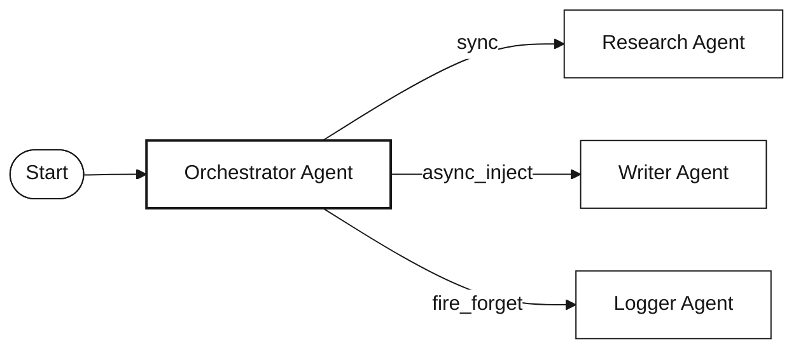

## What is a Workflow?

A **workflow** in Splox is a visual, node-based automation that connects AI models, tools, and integrations to accomplish complex tasks. Think of it as a programmable flowchart where each box (node) performs a specific action, and arrows (edges) define the execution path and data flow.

Workflows are the foundation of Splox, enabling you to:

<CardGroup cols={2}>
  <Card title="AI Agent Orchestration" icon="brain">
    Build autonomous agents that reason, plan, and use tools to complete complex tasks
  </Card>
  <Card title="Tool Integration" icon="wrench">
    Connect AI agents to external tools, APIs, MCP servers, and third-party platforms
  </Card>
  <Card title="Agentic Behavior" icon="robot">
    Agents iterate autonomously — calling tools, processing results, and deciding next steps
  </Card>
  <Card title="Multi-Agent Systems" icon="users">
    Create collaborative AI systems where multiple agents communicate with configurable execution modes
  </Card>
  <Card title="Conditional Logic" icon="code-branch">
    Route execution through branching paths with Switch nodes and conditional edges
  </Card>
  <Card title="Parallel Execution" icon="arrows-split-up-and-left">
    Fan out to multiple branches and merge results back together
  </Card>
</CardGroup>

### Key Capabilities

- **Visual Programming** — Build complex logic without code using an intuitive canvas interface
- **Chat Mode** — Test interactively with a conversational interface and real-time streaming
- **Flexible Patterns** — Support for sequential, parallel, conditional, and agent-loop execution
- **Real-time Testing** — See nodes execute live with immediate feedback and streaming output
- **Version Control** — Track changes, publish versions, and roll back when needed
- **Voice & Realtime** — Build voice-enabled agents with realtime audio capabilities

## Workflow Structure

### Node Types

Every workflow is built from **5 node types**:

<CardGroup cols={3}>
  <Card title="Start Node" icon="play" href="/nodes/start-node">
    Entry point that receives input data and triggers execution
  </Card>
  <Card title="Agent Node" icon="brain" href="/nodes/agent-node">
    Autonomous AI agent with LLM, memory, tool calling, and streaming
  </Card>
  <Card title="Tool Node" icon="wrench" href="/nodes/tool-node">
    Executes operations via MCP servers, custom tools, or external APIs
  </Card>
  <Card title="Switch Node" icon="code-branch" href="/nodes/switch-node">
    Conditional branching with multiple operators and AND/OR logic
  </Card>
  <Card title="Merge Node" icon="code-merge" href="/nodes/merge-node">
    Waits for all parent branches to complete, then merges their outputs
  </Card>
</CardGroup>

<Tip>
  You can also add **Note** nodes to annotate your canvas — these are visual-only and don't execute.
</Tip>

### Edge Types

Nodes connect through **4 edge types** that control execution flow and data transfer:

<CardGroup cols={2}>
  <Card title="Parallel Edges" icon="arrows-split-up-and-left" href="/edges/parallel-edges">
    Standard execution flow — triggers the next node when the source completes
  </Card>
  <Card title="Tool Edges" icon="wrench" href="/edges/tool-edges">
    Connect an Agent's TOOLS handle to Tool nodes for autonomous tool calling
  </Card>
  <Card title="Conditional Edges" icon="code-branch" href="/edges/conditional-edges">
    Route execution from Switch nodes based on IF/ELIF/ELSE conditions
  </Card>
  <Card title="Error Edges" icon="triangle-exclamation" href="/edges/error-edges">
    Activate when a node fails, enabling graceful error handling
  </Card>
</CardGroup>

### Visual Canvas

Workflows are built on a visual canvas with powerful editing capabilities:

<CardGroup cols={2}>
  <Card title="Add Nodes" icon="circle-plus">
    Right-click anywhere on the canvas to open a context menu with available nodes
  </Card>
  <Card title="Connect Nodes" icon="link">
    Draw edges between nodes by dragging from output to input handles
  </Card>
  <Card title="Configure" icon="gear">
    Click any node to open its settings panel and configure parameters
  </Card>
  <Card title="Navigate" icon="hand">
    Pan by dragging the canvas, zoom with mouse wheel or trackpad
  </Card>
</CardGroup>

<Frame>
  

    
  

  
  

    
  

</Frame>

## Workflow Lifecycle

<Steps>
  <Step title="Creation">
    When you create a new workflow, Splox automatically:
    - Generates a unique workflow ID
    - Sets up an empty canvas
    - Assigns it to your account
    - Creates initial configuration
  </Step>

  <Step title="Building">
    Build your workflow by:
    - Adding nodes from the context menu
    - Connecting nodes with edges
    - Configuring each node's settings (LLM model, system prompt, tools, etc.)
    - Saving your changes

    <Tip>
      **Start simple** — begin with a Start → Agent flow and add complexity as needed.
    </Tip>
  </Step>

  <Step title="Testing & Execution">
    ### Chat Mode

    **Purpose:** Interactive, conversational interface for testing and debugging workflows.

    **Features:**
    - In-editor sliding panel
    - Chat-based conversational interaction with real-time streaming
    - Node execution highlighting on the canvas
    - Multiple chat sessions management
    - Persistent chat history with context memory
    - Start node selection

    **Chat Actions:**
    - Create new chat
    - Switch between existing chats
    - Clear chat memory (flush history)
    - Delete chat
    - Share chat publicly
    - Leave chat session

    <Frame>
      

        
      

      
      

        
      

    </Frame>

    ### Execution Flow

    <Steps>
      <Step title="Select Start Node">
        Choose where to begin execution from the available start nodes
      </Step>
      <Step title="Provide Inputs">
        Enter required parameters, messages, or upload files
      </Step>
      <Step title="Run Workflow">
        Execute using Chat Mode or the API
      </Step>
      <Step title="Monitor Execution">
        Watch real-time status updates and streaming output as nodes process
      </Step>
      <Step title="View Results">
        See agent responses, tool results, and review execution logs
      </Step>
    </Steps>
  </Step>

  <Step title="Deployment">
    Once tested, deploy your workflow by:
    - Setting up triggers (webhooks, API calls)
    - Configuring execution settings
    - Enabling the workflow
    - Monitoring the first few runs
  </Step>

  <Step title="Monitoring">
    After deployment, monitor your workflow:
    - View execution history and tree
    - Check success/failure rates
    - Review error logs
    - Analyze performance metrics
  </Step>
</Steps>

## Execution Model

### Sequential Flow

The simplest pattern: nodes execute one after another.

Each node completes before the next one begins. Data flows forward through variable mappings.

### Parallel Execution

Use **parallel edges** to fan out and a **Merge node** to fan back in:

Both Agent nodes run simultaneously. The Merge node waits for all parents to complete, then combines their outputs (objects are merged, arrays concatenated).

### Conditional Branching

Use the **Switch node** for conditional logic:

The Switch node evaluates conditions with operators like `contains`, `equal`, `greater_than`, `starts_with`, `is_empty`, and more. Each case routes to a different branch via conditional edges.

### Agent Tool Loop

The **Agent node** is the core of agentic workflows. It autonomously calls tools, processes results, and iterates until the task is complete — all within a single node:

**How the Agent Loop Works:**

<Steps>
  <Step title="Agent Receives Input">
    The Agent node receives input from its parent (Start node payload, previous node output, or variable mappings) and appends it as a user message to its context memory.
  </Step>
  
  <Step title="LLM Reasoning">
    The Agent's configured LLM analyzes the conversation context (system prompt + memory + current input) and decides what action to take. It can either respond with text or call one or more tools.
  </Step>
  
  <Step title="Tool Execution">
    If the LLM requests tool calls, the Agent executes them via connected Tool nodes (through tool edges). Tool results are appended to the conversation context.
  </Step>
  
  <Step title="Iteration">
    The Agent loops back to the LLM with tool results. The LLM can call more tools or produce a final response. This continues until:
    - The LLM responds without tool calls (task complete)
    - The **max iterations** limit is reached (configurable, default: 10, max: 50)
    - A stop condition is triggered
  </Step>
  
  <Step title="Output">
    The Agent's final response flows to downstream nodes via parallel edges.
  </Step>
</Steps>

**Key Agent Capabilities:**

<Tabs>
  <Tab title="Context Memory">
    The Agent has **built-in conversation memory** — no separate memory node needed.
    
    - **Memory ID:** Links conversations across executions (e.g., `{{ start.chat_id }}`)
    - **Limit Type:** Token-based or message-based limits
    - **Trim Strategy:** `drop_oldest` or `drop_middle` when limits are reached
    - **Summarization:** Automatically summarize old messages to preserve context
    - **Custom Messages:** Inject predefined messages into the conversation
  </Tab>
  
  <Tab title="LLM Configuration">
    - **Provider & Model:** Choose from Anthropic, OpenAI, Gemini, OpenRouter, Perplexity, and more
    - **System Prompt:** Pongo2 template with variable mapping support
    - **Tool Choice:** `auto`, `required`, `none`, or specific tool name
    - **Thinking Tokens:** Enable extended thinking for complex reasoning
    - **Streaming:** Real-time token-by-token output
    - **Cache Control:** Optimize costs with prompt caching
  </Tab>
  
  <Tab title="Iteration Control">
    - **Max Iterations:** 1–50 (default: 10). Limits how many tool-call rounds the agent can perform.
    - **Stop Condition:** Pongo2 template that evaluates to true/false for early exit
    - **On Tool Error:** `continue` (skip failed tools) or `fail` (stop the agent)
  </Tab>
  
  <Tab title="Streaming">
    - **Enable Streaming:** Real-time token output via SSE
    - **Chat Streaming Mode:** `session` for persistent chat, or per-execution
    - **Voice/Realtime:** Audio streaming with supported providers (OpenAI, Gemini)
  </Tab>
</Tabs>

### Multi-Agent Workflows

Multiple Agent nodes can be connected to create collaborative multi-agent systems. When one Agent connects to another via a **parallel edge**, the child agent can be configured with different **execution modes**:

<Tabs>
  <Tab title="Sync">
    **`sync`** — Parent agent blocks and waits for the child agent to complete before continuing.
    
    Best for: Sequential delegation where the parent needs the child's result to proceed.
  </Tab>
  
  <Tab title="Async Inject">
    **`async_inject`** — Parent agent continues immediately. When the child completes, its result is automatically injected into the parent's conversation context.
    
    Best for: Background tasks where the parent can continue working while waiting for results.
  </Tab>
  
  <Tab title="Async Bidirectional">
    **`async_bidir`** — Both agents run concurrently. The child agent gets a `reply_to_parent` tool to send messages back to the parent at any time.
    
    Best for: Collaborative agents that need ongoing communication.
  </Tab>
  
  <Tab title="Fire & Forget">
    **`fire_forget`** — Parent triggers the child and continues immediately. No response is expected or received.
    
    Best for: Side effects, logging, notifications, or tasks where the result doesn't matter.
  </Tab>
  
  <Tab title="Handoff">
    **`handoff`** — Parent agent exits completely, transferring control to the child agent. The child takes over the conversation.
    
    Best for: Routing to specialized agents (e.g., escalation from a triage agent to a support agent).
  </Tab>
</Tabs>

**Agent-to-Agent Configuration:**

When connecting agents, you can configure:
- **Execution Mode:** How the child agent runs relative to the parent (see tabs above)
- **Child Tool Name & Description:** How the child agent appears as a tool to the parent
- **Reply Tool Name & Description:** For bidirectional mode, how the reply-to-parent tool appears

**Collaboration Patterns:**
- **Orchestrator Model:** One agent coordinates tasks by delegating to specialized child agents
- **Peer-to-Peer:** Agents communicate bidirectionally using `async_bidir` mode
- **Pipeline:** Agents chain sequentially, each processing and passing results forward
- **Handoff Chain:** Agents hand off control based on the conversation topic

<Tip>
  Multi-agent workflows excel at complex tasks that benefit from specialized expertise, parallel processing, and collaborative reasoning.
</Tip>

### Error Handling

Every node can have an **error edge** that activates when the node fails:

When a node fails:
1. Its **parallel (success) edges** are marked as skipped
2. Its **error edges** are activated, routing to fallback nodes
3. Downstream nodes on the skipped path are also marked as skipped

For Agent nodes, the `on_tool_error` setting controls whether individual tool failures cause the entire agent to fail (`fail`) or are reported back to the LLM to handle gracefully (`continue`).

<Info>
  Error edges are indicated by red connections in the workflow editor.
</Info>

## Node Execution States

During execution, each node transitions through these states:

| Status | Description |
|--------|-------------|
| **Pending** | Node is queued, waiting for parent nodes to complete |
| **In Progress** | Node is currently executing |
| **Completed** | Node finished successfully |
| **Failed** | Node encountered an error |
| **Blocked** | Node is waiting for external input (e.g., tool approval) |
| **Skipped** | Node was skipped (parent took a different branch or failed) |
| **Stopped** | Execution was manually stopped |
| **Waiting** | Node is waiting for async child agents to complete |

<Info>
  For detailed state transitions, see the [Node Lifecycle](/nodes/lifecycle) documentation.
</Info>

## Best Practices

<CardGroup cols={2}>
  <Card title="Start Simple" icon="seedling">
    Begin with a Start → Agent flow, then add tools and complexity as needed
  </Card>
  <Card title="Use Descriptive Labels" icon="tag">
    Name nodes clearly: "Research Agent" not "Node 1"
  </Card>
  <Card title="Handle Errors" icon="triangle-exclamation">
    Add error edges to critical nodes for graceful failure handling
  </Card>
  <Card title="Set Iteration Limits" icon="gauge">
    Configure appropriate max iterations on Agent nodes to prevent runaway loops
  </Card>
  <Card title="Leverage Context Memory" icon="brain">
    Use the Agent's built-in memory for conversational workflows instead of managing state manually
  </Card>
  <Card title="Choose Execution Modes" icon="arrows-split-up-and-left">
    Use the right agent-to-agent execution mode — sync for dependencies, fire_forget for side effects
  </Card>
</CardGroup>

## Next Steps

<CardGroup cols={2}>
  <Card title="Agent Node" icon="brain" href="/nodes/agent-node">
    Deep dive into the Agent node — the core of every workflow
  </Card>
  <Card title="Understanding Nodes" icon="cube" href="/concepts/nodes">
    Learn about all node types and their capabilities
  </Card>
  <Card title="Managing Edges" icon="link" href="/concepts/edges">
    How to connect nodes and control data flow
  </Card>
  <Card title="Build Your First Agent" icon="play" href="/tutorials/first-ai-agent">
    Step-by-step tutorial to build your first AI agent
  </Card>
</CardGroup>