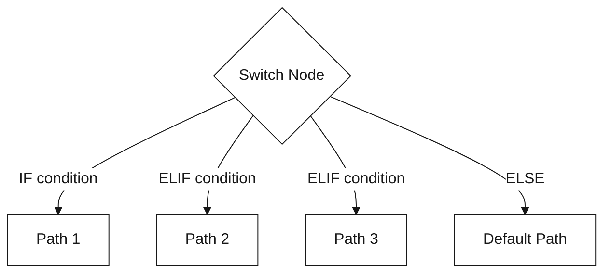

## Switch Node

**Purpose:** Conditional branching based on data evaluation

Switch nodes evaluate conditions and route execution to different paths.

<div className="block dark:hidden">
  
</div>

<div className="hidden dark:block">
  
</div>

**Node Handles:**

<Tabs>
  <Tab title="Input Handle">
    **Left Side - Condition Input**
    
    Receives data to evaluate against conditional branches.
    
    **Accepts:**
    - Workflow variables
    - Previous node outputs
    - Template expressions
    - Any data for conditional evaluation
  </Tab>
  
  <Tab title="Output Handles">
    **Right Side Handles (Dynamic):**
    
    - **IF:** First condition branch (primary path)
      - Activated when IF conditions evaluate to true
      - Routes to nodes for first conditional path
    
    - **ELIF 1, ELIF 2, ...:** Additional condition branches
      - Evaluated in order if previous conditions are false
      - Multiple ELIF branches can be added dynamically
      - Each represents an else-if conditional path
    
    - **ELSE:** Fallback branch
      - Activated when all IF/ELIF conditions are false
      - Default path when no conditions match
      - Always evaluated last
    
    - **ERROR:** Error handling path
      - Activated on condition evaluation errors
      - Passes error details
      - Allows graceful error recovery
  </Tab>
</Tabs>

<Info>
  Switch nodes support dynamic branching: you can add multiple ELIF branches for complex conditional logic. Branches are evaluated in order: IF → ELIF 1 → ELIF 2 → ... → ELSE.
</Info>

**Condition Operators:**

Splox switch nodes support 14 different operators for flexible conditional logic:

<AccordionGroup>
  <Accordion title="String Matching (6 operators)" icon="text" defaultOpen>
    <ResponseField name="contains" type="string">
      Check if value contains substring (case-insensitive)
      
      **Example:** `"Hello World" contains "world"` → `true`
    </ResponseField>
    
    <ResponseField name="not_contains" type="string">
      Check if value does not contain substring
      
      **Example:** `"Hello World" not_contains "xyz"` → `true`
    </ResponseField>
    
    <ResponseField name="equals" type="string">
      Exact match comparison (case-insensitive)
      
      **Example:** `"admin" equals "ADMIN"` → `true`
    </ResponseField>
    
    <ResponseField name="not_equals" type="string">
      Not equal comparison
      
      **Example:** `"user" not_equals "admin"` → `true`
    </ResponseField>
    
    <ResponseField name="starts_with" type="string">
      Check if value starts with prefix
      
      **Example:** `"Hello World" starts_with "Hello"` → `true`
    </ResponseField>
    
    <ResponseField name="ends_with" type="string">
      Check if value ends with suffix
      
      **Example:** `"file.pdf" ends_with ".pdf"` → `true`
    </ResponseField>
  </Accordion>
  
  <Accordion title="List Operations (2 operators)" icon="list">
    <ResponseField name="in" type="string">
      Check if value exists in comma-separated list
      
      **Example:** `"apple" in "apple,banana,orange"` → `true`
    </ResponseField>
    
    <ResponseField name="not_in" type="string">
      Check if value does not exist in list
      
      **Example:** `"grape" not_in "apple,banana,orange"` → `true`
    </ResponseField>
  </Accordion>
  
  <Accordion title="Empty & Boolean Checks (4 operators)" icon="circle-check">
    <ResponseField name="is_empty" type="unary">
      Check if value is empty, null, `[]`, or `{}`
      
      **Example:** `"" is_empty` → `true`
    </ResponseField>
    
    <ResponseField name="is_not_empty" type="unary">
      Check if value has content
      
      **Example:** `"Hello" is_not_empty` → `true`
    </ResponseField>
    
    <ResponseField name="is_true" type="unary">
      Check if value is truthy (`true`, `1`, `yes`, `y`)
      
      **Example:** `"true" is_true` → `true`
    </ResponseField>
    
    <ResponseField name="is_false" type="unary">
      Check if value is falsy (`false`, `0`, `no`, `n`)
      
      **Example:** `"false" is_false` → `true`
    </ResponseField>
  </Accordion>
  
  <Accordion title="Numeric Comparison (4 operators)" icon="calculator">
    <ResponseField name="gt" type="number">
      Greater than (numeric comparison with string fallback)
      
      **Example:** `10 gt 5` → `true`
    </ResponseField>
    
    <ResponseField name="lt" type="number">
      Less than
      
      **Example:** `3 lt 7` → `true`
    </ResponseField>
    
    <ResponseField name="gte" type="number">
      Greater than or equal
      
      **Example:** `10 gte 10` → `true`
    </ResponseField>
    
    <ResponseField name="lte" type="number">
      Less than or equal
      
      **Example:** `5 lte 8` → `true`
    </ResponseField>
  </Accordion>
</AccordionGroup>

<Info>
  **Unary operators** (`is_empty`, `is_not_empty`, `is_true`, `is_false`) don't require a right operand.
</Info>

**Condition Logic:**

<Tabs>
  <Tab title="AND Logic">
    **All conditions must be true**
    
    ```typescript
    if (condition1 && condition2 && condition3) {
      // Take this path
    }
    ```
    
    Use for: Strict validation, multiple requirement checks
  </Tab>
  
  <Tab title="OR Logic">
    **Any condition can be true**
    
    ```typescript
    if (condition1 || condition2 || condition3) {
      // Take this path
    }
    ```
    
    Use for: Flexible matching, fallback scenarios
  </Tab>
</Tabs>

**Branching:**

Switch nodes support multiple branches evaluated in order:

<div className="block dark:hidden">

</div>

<div className="hidden dark:block">

</div>

```mermaid
%%{init: {'theme':'base', 'themeVariables': {'primaryColor':'#252526','primaryTextColor':'#fafafa','primaryBorderColor':'#fafafa','lineColor':'#fafafa','secondaryColor':'#1e1e1e','tertiaryColor':'#252526','background':'#1e1e1e','mainBkg':'#252526','secondBkg':'#1e1e1e','textColor':'#fafafa','nodeTextColor':'#fafafa','nodeBorder':'#fafafa','edgeLabelBackground':'#252526'}}}%%
graph TB
    Switch{Switch Node}
    Switch --> |IF condition| Path1[Path 1]
    Switch --> |ELIF condition| Path2[Path 2]
    Switch --> |ELIF condition| Path3[Path 3]
    Switch --> |ELSE| Default[Default Path]
    
    style Switch fill:#1e1e1e,stroke:#fafafa
    style Path1 fill:#1e1e1e,stroke:#fafafa
    style Path2 fill:#1e1e1e,stroke:#fafafa
    style Path3 fill:#1e1e1e,stroke:#fafafa
    style Default fill:#1e1e1e,stroke:#fafafa
```

- **IF:** First condition evaluated
- **ELIF:** Additional conditions (evaluated if previous failed)
- **ELSE:** Default path if no conditions match

**Example Use Cases:**
- Content moderation (check for inappropriate content)
- User role routing (admin vs. user paths)
- Error handling (check for error states)
- A/B testing (route based on user segment)

---

