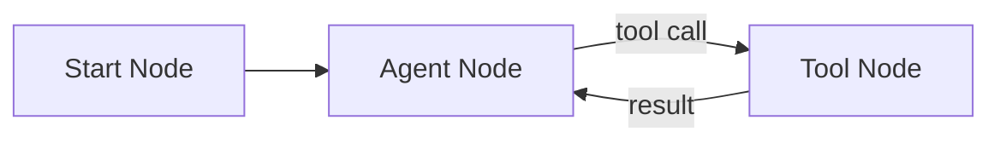

In this tutorial you'll build a fully working AI agent from scratch using the Splox workflow builder. No templates, no shortcuts — just three nodes wired together.

**Time to complete:** 5 minutes  
**Skill level:** Beginner

---

## What You'll Build

A simple autonomous agent that:
- Receives a user message via the **Start** node
- Thinks and decides what to do via the **Agent (LLM)** node
- Takes actions using a connected **Tool** node



---

## Prerequisites

- A [Splox account](https://app.splox.io)
- At least one MCP connection set up (e.g. Serper, Telegram, or any other tool)

---

## Step 1: Create a New Workflow

1. Go to [app.splox.io](https://app.splox.io) and open the **Workflows** section
2. Click **New Workflow**
3. Give it a name — e.g. `My First Agent`
4. The workflow canvas opens with an empty graph

---

## Step 2: Add a Start Node

The Start node is the entry point — it's how your workflow gets triggered.

1. Right-click on the canvas → **Add Node** → **Start**
2. In the node config panel on the right, set the **Trigger** to `Webhook`
3. Click **Save**

<Note>Every workflow needs exactly one Start node. It defines how the workflow is triggered and what input it receives.</Note>

---

## Step 3: Add an Agent Node

The Agent node is an LLM that reads the input, reasons about it, and decides whether to call a tool or respond directly.

1. Right-click on the canvas → **Add Node** → **Agent**
2. In the config panel:
   - **Model** — pick any model (e.g. `claude-sonnet-4-5` or `gpt-4o`)
   - **System Prompt** — write a short instruction, e.g.:

```
You are a helpful assistant. Use available tools when needed to answer the user's question.
```

3. Click **Save**

---

## Step 4: Add a Tool Node

The Tool node gives your agent the ability to take real actions — search the web, send messages, query APIs, and more.

1. Right-click on the canvas → **Add Node** → **Tool**
2. In the config panel:
   - **MCP Server** — select your connected MCP server (e.g. Serper for web search)
   - **Tool** — select the specific tool (e.g. `serper_search`)
3. Click **Save**

---

## Step 5: Connect Everything

Now wire the nodes together:

1. **Start → Agent**: drag from the Start node's output handle to the Agent node's input handle
2. **Agent → Tool**: drag from the Agent node's **TOOLS** handle to the Tool node's input handle

<Note>Make sure you connect from the **TOOLS** handle (not the PARALLEL handle) on the Agent node. This enables the tool-calling loop so results return back to the Agent.</Note>

Your canvas should look like this:

```
[Start] ──► [Agent] ──(tools)──► [Tool]
                ▲                     │
                └─────────────────────┘
```

---

## Step 6: Run It

1. Click **Save** in the top toolbar
2. Open the **Chat** panel (bottom toolbar → chat icon)
3. Type a message, e.g.:

```
Search the web for the latest AI news
```

4. Hit **Enter** — your agent will call the tool, get the result, and respond

---

## What's Happening Under the Hood

<AccordionGroup>
  <Accordion title="Why does the Tool connect back to the Agent?">
    When an LLM calls a tool, it needs to receive the result back to continue reasoning. The TOOLS edge creates this loop — the Agent calls the Tool, gets the result, and then decides what to do next (call another tool or respond to the user).
  </Accordion>

  <Accordion title="Can I add more tools?">
    Yes. Add more Tool nodes and connect them all to the Agent's TOOLS handle. The agent will automatically know about all connected tools and choose the right one based on context.
  </Accordion>

  <Accordion title="What's the difference between TOOLS and PARALLEL handles?">
    - **TOOLS** — used for tool-calling loops (Agent ↔ Tool). Results return to the Agent.
    - **PARALLEL** — used for regular sequential or parallel flow. The Agent's output passes to the next node without looping back.
  </Accordion>
</AccordionGroup>

---

## Next Steps

- **Add more tools** — connect multiple Tool nodes to give your agent more capabilities
- **Add memory** — connect a Memory node to the Agent's MEMORY handle for multi-turn conversations
- **Go parallel** — check out [Parallel Agents](/tutorials/parallel-agents) to run multiple agents simultaneously
- **Build multi-agent systems** — explore [Multi-Agent Teams](/tutorials/multi-agent-team)

---

## Need Help?

- Join our [Telegram community](https://t.me/splox_ai)
- Browse the [concepts docs](/concepts/workflows) to go deeper
- Ask questions at [community.splox.io](https://community.splox.io)
